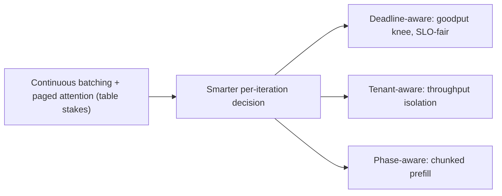

## The frontier & operating a live serving batch

**In brief.** Continuous batching plus paged attention is settled science and treated as a single
serving bedrock, so the frontier is no longer whether to batch continuously — it is **how the
scheduler decides what to run each step** once raw throughput is table stakes. The production
dashboard asks the same question from the other side: is the running batch doing useful work, and
where is the next wall?

**Where the frontier is.**

- **From throughput to SLO-aware / goodput scheduling.** The step past raw tokens per second is to
  size the running batch to the **goodput knee** — the point where extra batch stops improving
  work-completed-within-SLO — instead of a fixed cap. A goodput-aware scheduler treats the latency
  SLO as an admission and batch-sizing signal, not as something to discover in the p95 dashboard
  after the fact. This is the accepted way to size a batch now; turning it into a concrete, robust
  policy is still active work.
- **Multi-tenant fairness and interference.** Two problems the canon names as genuinely unsolved.
  **SLO-fair scheduling** asks how to schedule one shared batch so latency SLOs are met fairly across
  requests, reasoning about per-request deadlines rather than a single aggregate throughput number.
  **Multi-tenant throughput isolation** asks how a shared replica keeps one tenant's burst from
  starving another's goodput. Neither has a settled answer — unlike static versus continuous
  batching, which is long since decided.
- **Chunked prefill and the prefill/decode interaction.** Prefill is compute-heavy and bursty; decode
  is latency-sensitive and steady. Mixing them naively inside one running batch lets a wave of long
  prefills spike decode TPOT. The frontier direction is **interference-aware** scheduling that splits
  a long prefill into chunks so it interleaves with decode instead of pinning the batch, protecting
  the decode tail that goodput measures — not a blanket claim of higher throughput.

**Signals to watch in production.**

- **Queue depth and wait time** — how many requests wait to be admitted, and for how long. A
  **leading** capacity signal: rising queue depth shows up as climbing TTFT before it shows up as
  outright errors, and it is what should drive admission decisions and autoscaling.
- **Preemption rate** — how often the scheduler evicts or defers a running sequence under memory or
  SLO pressure. Also **leading**: rising preemption spikes tail latency and warns that the running
  batch is over-subscribed for the offered load, ahead of failures.
- **Batch occupancy** — how many sequences actually decode each step versus the cap. This is a
  **capacity-planning** gauge, not an early alert. Chronically low occupancy means an idle or
  memory-bound GPU (paged KV is what converts wasted HBM back into batch size); pinned at the cap
  under load means you are one spike from queueing.
- **Goodput versus raw throughput** — read together, and for capacity planning rather than alerting.
  Raw tokens per second keeps climbing as the batch grows; when throughput rises while goodput
  flattens or falls, the extra work is all requests missing their SLO.

**Why it matters.** Alert on **queue depth, wait time and preemption rate** as the leading
indicators, capacity-plan on occupancy and the goodput-versus-throughput gap, and never declare
victory on a raw-throughput number when the SLO — and therefore goodput — is the real objective.
