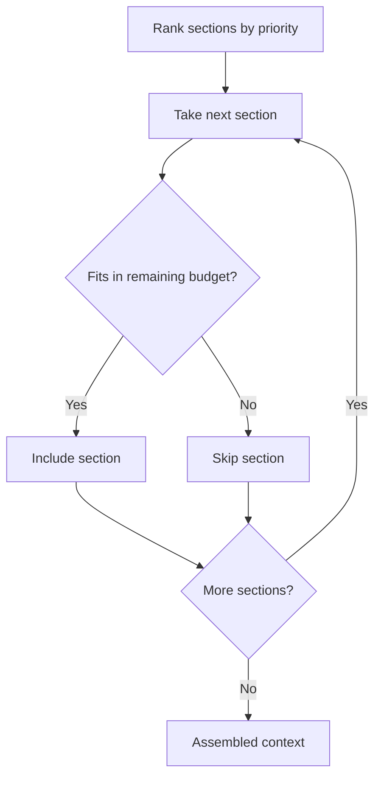

# Build it: a budget-aware context assembler

## Rank then fit

The context window is a fixed **token budget**, not a dumping ground. You have candidate sections —
system instructions, retrieved docs, memory, history — each with a **priority** and a **token cost**.
Assembling context is two moves:

1. **Rank** the sections by priority (most important first).
2. **Fit** them greedily: walk the ranked list and include a section only if it still fits under the
   budget; skip the ones that would overflow.

Never just concatenate everything and hope. The point is to spend a scarce budget on the tokens that
matter most.

## Why drop not truncate blindly

Two failure modes justify dropping the low-priority overflow:

- **Budget overflow** — including everything blows past the window (or the model's effective context).
- **Context rot** — even when it fits, padding the window with low-value tokens *dilutes* the
  important ones and degrades accuracy. Fewer, higher-priority tokens beat more, noisier ones.

So a section that doesn't fit is **skipped whole** (keep it simple), and the assembler keeps scanning
— a *smaller*, lower-priority section later in the list may still fit in the remaining budget.

Worked example: sections `A(priority 3, 100 tokens)`, `C(priority 2, 100)`, `B(priority 1, 50)`,
budget `220` → include `A` and `C` (200 tokens); `B` would make 250, so it's dropped. Raise the budget
to 260 and `B` fits too. The ranking decides *what* survives when the budget is tight.

This rank-then-fit assembler matters because it is the concrete, testable core of context engineering:
it turns "spend the budget on what matters" from a slogan into code you can run.
