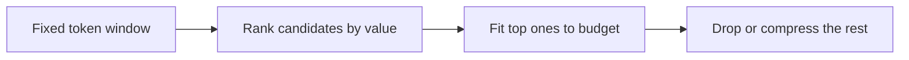

# Context engineering — token-budget roadmap

## Roadmap: the ranked token budget

**What this section covers.** The founding reframe of the whole topic: the context window is not a
scratch pad to fill but a **finite, ranked token budget** you spend on purpose — so the question is
never "what could I include?" but "which tokens are worth the space?"

**The ideas you'll meet:**

- **Token budget** — the window has a hard token cap; every candidate is spent against it.
- **Rank-then-fit-to-budget** — score candidates by relevance, then admit the top ones until the budget is spent.
- **Dump-everything / unranked concatenation** — the antipattern of pasting it all in and hoping the model sorts it out.
- **Context rot** — quality degrading as the window fills with low-value tokens that dilute the signal.
- **Token accounting** — knowing what each candidate costs and what budget remains, so you compress or drop instead of concatenating.

**Why it matters.** Everything else in context engineering — position, selection, compaction — is a
way of spending a scarce budget well; get the budget mindset wrong and the rest cannot save you.
