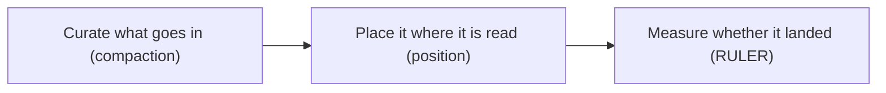

# Context engineering — frontier & operations roadmap

## Roadmap: reviewing, operating & the frontier

**What this section covers.** The expert layer: how to critique a context pipeline the way a design
review or interviewer would, the canon papers to cite, the production signals you watch when it is
live, and the research frontier of compaction and effective context.

**The ideas you'll meet:**

- **The design-space levers** — budget, selection, position, compaction, and structure/reuse, each with a tradeoff to name.
- **Common → SOTA → antipattern** — the ladder for rating any subsystem, and the design-review checklist that grades a pipeline.
- **The canon** — "Lost in the Middle," needle-in-a-haystack, and RULER as the prior art to cite.
- **Retrieval + compaction** — the SOTA pipeline that summarizes or prunes overflow instead of dropping it, and the open problem of doing so without information loss.
- **Production signals** — truncation/eviction rate, effective-vs-advertised drift, position of key facts, and tokens-per-request trend.

**Why it matters.** Naming the lever, its cost, and the regime where it wins — plus the eval that
proves it — is exactly what separates someone who *knows* context engineering from someone who *runs*
it at the frontier.
