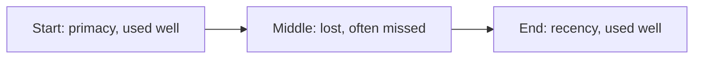

# Context engineering — position-effects roadmap

## Roadmap: position effects

**What this section covers.** *Where* a fact sits in the window changes how well the model uses it.
Retrieval accuracy over position is roughly U-shaped — strong at the edges, weak in the middle — so
ordering, not just inclusion, is a lever you control.

**The ideas you'll meet:**

- **Lost in the middle** — the finding (Liu et al., 2023) that models under-use facts buried in the middle of a long context.
- **Primacy and recency** — content near the start and the end of the window is used best.
- **U-shaped accuracy** — plotted against position, retrieval is high at the edges and sags in the middle.
- **Position as a lever** — once content is selected, order it deliberately, placing the most important evidence at the edges.
- **Effective vs. advertised context** — needle-in-a-haystack and RULER measure the window a model actually uses, not the one it claims.

**Why it matters.** A relevant fact dropped into the middle of a long prompt can be effectively
invisible — so placement can rescue or waste the very same tokens for free at serve time.
