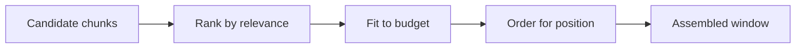

# Context engineering — selection roadmap

## Roadmap: selection & retrieval

**What this section covers.** When there are more candidates than the budget can hold, **selection**
(retrieval) decides what actually enters the window — rank by relevance, fit to budget, order for
position, and structure for reuse — and how to build that assembler in code.

**The ideas you'll meet:**

- **Selection / retrieval** — choosing which of many candidate chunks enter a bounded window.
- **Relevance ranking** — scoring candidates with embedding similarity, a retrieval score, or a reranker.
- **Rank-then-fit-to-budget** — greedily admit the highest-scoring chunks while budget remains, then drop or compress the rest.
- **Stable prefix, variable suffix** — fixed content up front, per-request content after, so a **prompt cache** can reuse the prefix.
- **Headroom** — reserving budget for the model's own reasoning and output rather than spending it all on retrieval.

**Why it matters.** Selection is where the budget, relevance, and position ideas become one concrete
pipeline — the difference between a bounded, high-signal window and a long, diluted one.
