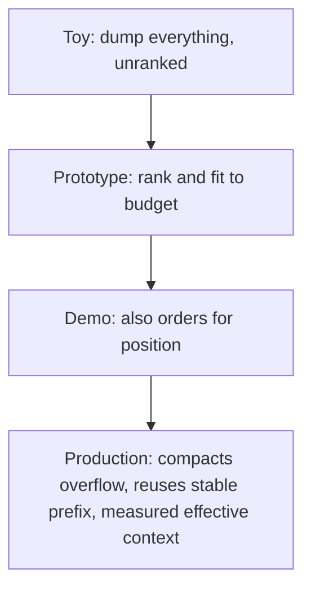

## Reviewing a context pipeline

**In brief.** Every context decision is really one decision: which tokens earn a place in a fixed
window, in what order, so the model can actually use them. Reviewing a pipeline — in a design doc or
an interview — means walking five levers, naming what each one costs, and rating how many of the
review questions the design actually answers.

**The five levers.**

- **Budget allocation** — carve the fixed window into slices: system prompt, retrieved evidence,
  conversation history, and reserved headroom for reasoning and output. The window is a cap, so
  over-spending one slice starves another; spend it all on retrieval and the model has no room to
  think.
- **Selection and retrieval** — rank candidates (embedding similarity, a retrieval score, a
  reranker) and greedily admit the top ones while budget remains. The alternative — returning as
  many chunks as the store gives back, in whatever order it gives them — is unranked
  dump-everything. It buys a little recall and pays for it three ways: **dilution** (context rot,
  as marginally-relevant tokens bury the signal), **cost** (you pay per token), and **latency**
  (longer inputs process slower). Past a point extra tokens lower task quality rather than raise it,
  which is why "more context is always better" is a red flag, not a strategy.
- **Position and ordering** — retrieval accuracy over position is roughly U-shaped: primacy and
  recency are strong, the middle is weak. So the highest-ranked evidence belongs near the **start**
  or the **very end**. Placing the top chunk dead-center to "give it balanced attention" puts it
  exactly where models under-use it — correct ranking does not save a layout that buries the winner
  mid-context. Re-ordering costs nothing at inference time and recovers facts a naive concatenation
  wastes.
- **Compaction** — content that is relevant but does not fit gets **summarized** or **dropped**,
  never forced in. It lets long histories survive without crowding out fresh signal, at the cost of
  lossy summaries.
- **Structure and reuse** — a **stable prefix** (system prompt, standing instructions) with
  per-request content in a **variable suffix**, so **prompt caching** can reuse the prefix. A
  2,000-token system prompt reused across a thousand calls gets paid for effectively once instead of
  a thousand times. The cost is the bookkeeping to keep the prefix truly stable.

**The review checklist.**

- Is the window treated as a ranked budget, or is content concatenated unranked "to be safe"?
- Where does the token accounting live? No notion of what fits and what gets dropped means no real
  budget.
- Is position handled deliberately, or can the single most important fact sink into the middle and
  go unused even though it is present?
- What is the overflow policy — compress, drop, or re-surface? A real design names one; it is never
  "it all just fits."
- Advertised versus **effective** context: a design that packs 180k tokens because the box says 200k
  is claiming capacity it has not verified. Usable performance is measured with a long-context eval
  (needle-in-a-haystack, RULER) before you rely on it — and the gap compounds with dilution as the
  window fills.

**The rating ladder.** How many of those a design answers is its rating. A **toy** dumps everything;
a **prototype** ranks and fits to a budget; a **demo** also orders for position; a
**production-ready** design compacts overflow deliberately, reuses a stable prefix for caching, and
has measured its effective context rather than trusting the number on the box.

**Why it matters.** Name the lever, name what it costs, name the regime where it wins — that is the
design review and the interview answer in miniature. The senior signal is treating the window as a
ranked token budget and reasoning about position and dilution; the red flags that sink a candidate
are the mirror image: dump-everything prompts, ignoring context rot, "more context is always
better," and trusting the advertised window as if it were the effective one.
