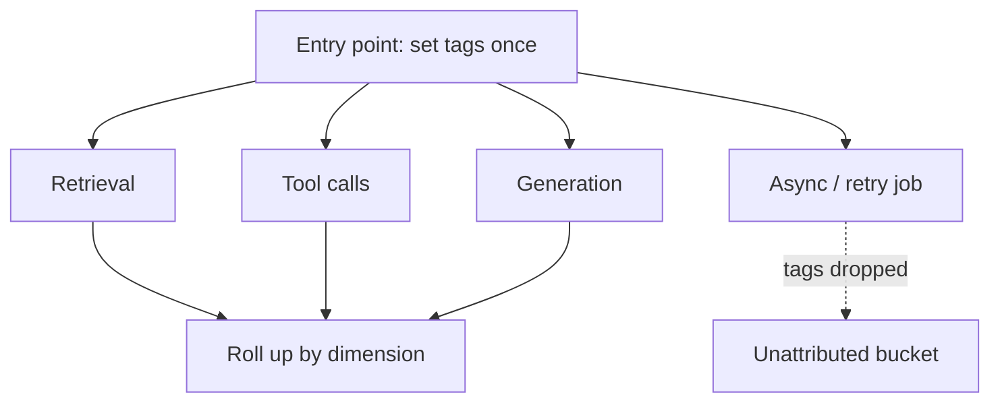

# Cost attribution — dimensions and tag propagation

## Attribution dimensions

If per-model cost is the wrong lens, the right ones are the dimensions the business cares about:

- **Feature** — which product capability spent the money.
- **Workflow** — which multi-step pipeline (e.g. onboarding, summarization) ran.
- **Tenant** — which customer/account, essential for fair billing and margin.
- **User journey** — the end-to-end path a user took, spanning several calls.

These are the levels where you can actually *decide* something: shrink a feature's context, rein in a
tenant's workflow, or reprice a journey. Cost that can't be sliced by these dimensions can't be
optimized deliberately.

## Tag propagation

You attribute cost by attaching **attribution tags** — feature, workflow, tenant, journey — to each
call, so its cost record can be **rolled up** by dimension later. The hard part is that a single user
request fans out into many downstream calls: embeddings, retrieval, tool invocations, generation, and
retries.

**Tag propagation** is the discipline of setting the attribution context **once at the entry point**
and carrying it through **every** downstream call, so no cost record is orphaned. When propagation
breaks — a **background/async job** or a shared cache that drops the tags — that spend lands in an
**unattributed** bucket: still on the provider bill, but invisible to every rollup. Unattributed cost
is exactly where attribution fails, so the goal is to leave nothing untagged.

