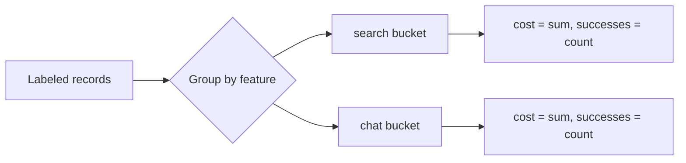

# Build it: attributing cost per feature

## Rolling up cost by feature

Every model call produces a **record**: what it cost, which *feature* (or workflow / tenant) it
served, and whether the task ultimately **succeeded**. Attribution is just a group-by: bucket records
by the dimension you care about, and within each bucket sum the cost and count the successes.

The mechanical part is easy — the discipline is carrying the *feature* and *success* labels through
your pipeline so every record can be attributed at all. Once you have labeled records, a feature
rollup is `{ cost: Σcost, successes: #(success===true) }`.

## Cost per successful task

The metric that actually matters is **cost per successful task** = `total cost / number of successes`
— not cost per request, and not cost per model. Here's why it's different:

- Failed runs still cost money (you paid for the tokens) but produce **zero** successes.
- Retries multiply the cost of a single eventual success.

So a feature whose per-request cost looks fine can have a **much higher** cost-per-success if it fails
or retries a lot. Dividing by *requests* hides that; dividing by *successes* exposes it.

Worked example: feature `search` has two records — `$2` (success) and `$4` (failed) → cost `$6`,
successes `1` → **cost/success = $6**. Feature `chat` has `$3` + `$1`, both success → cost `$4`,
successes `2` → **cost/success = $2**.

One edge case to guard: a feature with **zero** successes has no cost-per-success — return `null`
(or "N/A"), never `NaN` from dividing by zero.
