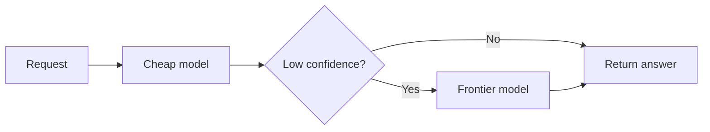

# Cost attribution — the frontier and operating it in production

The deep-dive gave you the levers. This lesson drills the two things that separate someone who *knows*
cost attribution from someone who *runs* it at the frontier: the current research edge, and the
operational signals you watch when it's live.

## The cost-attribution frontier

Three research directions are where cost-attribution work is actually moving right now.

- **Cost-per-successful-outcome vs. per-token unit economics.** The honest unit is already
  cost-per-successful-*task* — retries, abandonment, and over-retrieval hide inside a per-token number.
  The frontier pushes one step further: pricing and measuring on the **business outcome** (a resolved
  ticket, a completed booking) rather than a completed model call. The load-bearing move is choosing a
  denominator you can defend end-to-end with hidden costs included; the open problem is **predicting
  per-feature cost before ship** — forecasting against an unknown traffic mix, which is estimation, not
  accounting, and rarely survives contact with real traffic.

- **FrugalGPT-style cascades as a cost lever.** **FrugalGPT** (Chen et al., 2023) made LLM *cost* a
  first-class target: send a request to a cheap model first and **escalate to a stronger model only on
  low confidence**. The reason to track this line for attribution specifically is that a cascade
  *changes what a task costs* — the same feature now bills a mix of cheap-model and frontier-model
  calls, so your attribution has to roll up spend across the tiers a single task touched, not per model.
  The headline "match GPT-4 at a fraction of the cost" figure was model- and price-specific; the durable
  idea is route-cheap-first, escalate-on-low-confidence, and measure quality-per-dollar.

- **Fair allocation of shared, cached, and async cost.** The hard open problem: a cache hit, a shared
  system prompt, or a background job serves **many tenants and features at once**, and there is **no
  single correct policy** for splitting that cost. Provider prompt/prefix caching sharpened this —
  cached reads bill at a fraction of input price, so the cheap tokens still belong to *some* feature and
  must be attributed, not dropped. An expert names an **explicit, defensible** allocation rule (split by
  usage share, charge the requester who warmed the cache, or pool-and-prorate) rather than letting the
  policy hide silently inside a cache key.

The reason to track this line specifically: all three attack the same gap — a per-token, per-model bill
tells you *what* you spent, not *what value it bought or who it was for*. An expert can say which lens a
given cost question needs first.

## Operating cost attribution in production

When it's live, you don't watch "the bill" — you watch a handful of signals that tell you whether
attribution is trustworthy and where spend is actually going.

- **Cost-per-success by feature / tenant.** The headline operating metric: spend divided by *successful*
  outcomes, sliced by the dimension you can act on. A feature whose cost-per-success drifts up is
  leaking money to retries, abandonment, or over-retrieval — and a zero-success slice is a
  divide-by-zero you must guard, not a free feature.
- **Tag-coverage %.** The share of billed spend that carries an actionable attribution tag. Falling
  coverage means an untagged async job or a broken retry is dumping real money into the **unattributed
  bucket** — you can't optimize what you can't see, so this is the leading indicator that your numbers
  have gone blind, before any dashboard looks wrong.
- **Cache-hit cost savings.** The spend avoided by prompt/prefix and semantic cache hits, attributed
  back to the features that benefit. This is both an optimization scoreboard and the input to the
  shared-cost allocation policy above — untracked, cached savings silently distort every per-feature
  number.
- **Cost-per-request trend (and its slope).** Because a "request" fans out into several billed calls
  once retrieval, tools, and retries are counted, a creeping cost-per-request at constant traffic is the
  early sign that context is growing or the cascade is escalating more often. Capacity- and
  budget-planning track the *trend*, not a single month's total.

The operational discipline: alert on **tag-coverage and cost-per-success drift** (leading indicators
that attribution or unit economics are slipping), budget-plan on **cost-per-request trend and
cache-hit savings**, and never reason about spend in "cost per model" when the real currency is **cost
per successful outcome, attributed to a dimension you can act on**.
