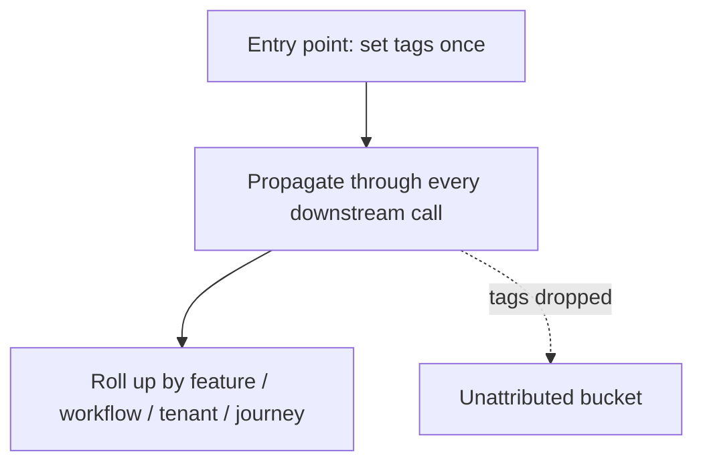

# Cost attribution — attribution roadmap

## Roadmap: attribution dimensions and tag propagation

**What this section covers.** The business dimensions you attribute spend to instead of the model, and
the propagation discipline that carries an attribution context through a request's fan-out so no cost
record is orphaned.

**The ideas you'll meet:**

- **Attribution dimensions** — feature, workflow, tenant, and user journey: the levels where you can actually decide something.
- **Attribution tags** — the feature/workflow/tenant/journey labels attached to each call so its cost can be rolled up later.
- **Tag propagation** — setting the attribution context once at the entry point and carrying it through every downstream call.
- **Fan-out** — the way one user request becomes many calls: embeddings, retrieval, tools, generation, retries.
- **Unattributed bucket** — where spend lands when an async job or shared cache drops the tags: still billed, but invisible to every rollup.

**Why it matters.** Cost that can't be sliced by a dimension the business can act on can't be optimized
deliberately, and every broken propagation path quietly moves real money out of view.
