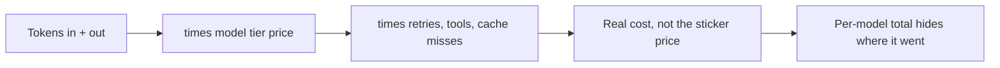

# Cost attribution — cost drivers roadmap

## Roadmap: cost drivers and the granularity trap

**What this section covers.** What actually drives an LLM call's cost — tokens, model tier, and the
multipliers that turn "one request" into several billed calls — and why reading spend *per model* is
the wrong granularity for deciding where to optimize.

**The ideas you'll meet:**

- **Input tokens** — everything you send: system prompt, retrieved context, tool schemas, history.
- **Output tokens** — everything the model generates, usually priced higher than input.
- **Model tier** — which model at which per-token price does the work.
- **Multipliers** — retries, extra tool round-trips, and cache hits/misses that quietly multiply a single request's bill.
- **Per-model granularity** — one aggregate figure that tells you *what* you spent but not *where* value or waste accrues.

**Why it matters.** Estimating from the happy-path prompt undershoots every time, and a per-model total
gives leadership nowhere to aim — so getting the drivers and the granularity right is the precondition
for every optimization that follows.
