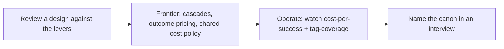

# Cost attribution — frontier & operations roadmap

## Roadmap: reviewing, operating, and the frontier

**What this section covers.** The expert layer: the levers you pull when designing a cost-attribution
system and how to critique one, the research frontier and operational signals that separate knowing it
from running it, and the canon plus interview moves that read as senior.

**The ideas you'll meet:**

- **Design levers** — granularity, propagation, unit metric, cost lens, and shared-cost handling, each with a tradeoff.
- **Common / SOTA / antipattern** — the ladder for placing any attribution design, from per-model-only to first-class cost.
- **FrugalGPT cascades** — route cheap-first and escalate on low confidence, so a task's cost spans model tiers.
- **Shared-cost allocation** — the open problem of splitting cached, async, and pooled spend fairly across tenants.
- **Operating signals** — cost-per-success drift, tag-coverage %, cache-hit savings, and cost-per-request trend.
- **FinOps and the canon** — tag/attribute/optimize continuously; name FrugalGPT and Helicone/Langfuse/LiteLLM.

**Why it matters.** A per-token, per-model bill tells you *what* you spent, not what value it bought or
who it was for — and being able to say which lens a cost question needs first is exactly what an
interviewer and a design review are testing.
