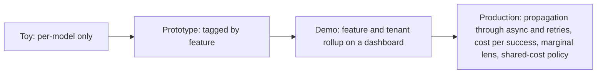

## Reviewing a cost-attribution design

**In brief.** Every cost-attribution decision is really one question: how faithfully does every billed
token roll up to a dimension the business can act on, and at what instrumentation and accuracy cost?
Reviewing one — in a design doc or an interview — means walking five levers and refusing to accept a
number that flatters.

**The five levers.**

- **Attribution granularity** — cost per **model** vs. cost per **feature / workflow / tenant / user journey**. A per-model total aggregates every use of that model across every feature, workflow, and tenant into one figure: it tells you **what** you spent but not **where** value or waste accrues, so it gives you nowhere to aim when leadership says "cut spend." This is the single biggest structural lever — the difference between "the bill went up" and "this feature's over-retrieval is half the bill." A feature is something you own and can change; the model is a shared input across many features.
- **Tag propagation** — set the attribution context **once at the entry point** and carry it through every downstream call (embeddings, retrieval, tools, generation, retries), vs. tagging only the top-level request. Propagation is what keeps one request's fan-out from orphaning cost into an **unattributed** bucket: still on the provider bill, invisible to every rollup.
- **Unit metric** — cost per API call vs. **cost per successful task**. Per-call flatters, because a single successful outcome often takes several calls, retries, and abandoned attempts; computing it on happy-path calls only compounds the understatement. The honest number counts failed and abandoned runs and charges that waste to the tasks that actually succeeded. The fix is the metric and its coverage — not banning per-call reporting entirely.
- **Cost lens for decisions** — **blended** average across all features vs. **marginal** cost a specific feature or change adds per task. Blended smears expensive and cheap work together and hides the ship-or-not decision; marginal isolates the incremental spend a change causes.
- **Shared-cost handling** — how **cached, async, and pooled** work is attributed. A cache hit, a background job, or a shared system prompt serves many tenants at once; a design must decide whether that cost is dropped, dumped on one tenant, or fairly split.

**The review checklist.**

- What granularity does it report? If it stops at cost-per-model, stop there — leadership will have nowhere to aim.
- Does every call get tagged, and do tags propagate through **retries and async work**? No propagation means an unattributed bucket hiding real money.
- What is the unit metric — cost per successful task with failed and abandoned runs counted, or a per-call number computed on the happy path?
- Blended or marginal for a new feature's decision? Marginal is the ship signal.
- How is shared, cached, or async cost allocated? A real design names its policy — never "it just averages out."

**Rating a design, and the red flags.**

- **Toy** reports per-model only. **Prototype** tags by feature. **Demo** attributes across feature and tenant with a dashboard — but if an async background job or a shared prompt cache makes untagged calls, that spend lands in the unattributed bucket, and the fix is threading the attribution context through those paths, not accepting the blind spot. **Production-ready** also propagates tags through async and retries, reports cost per successful task, uses marginal cost for feature decisions, and has a defensible shared-cost allocation policy.
- **Antipatterns that pass a demo and fail under traffic** — cost-per-model-only reporting; ignoring failed and abandoned runs so the unit cost is understated; treating over-retrieval or oversized context as free because "chunks are cheap"; letting async or cached work drop its tags.
- **What reads as shallow** — "just add a cost dashboard," or "pick the cheapest model," without naming the granularity trap and the propagation discipline.

**Why it matters.** Name the lever, name what it costs, name the regime where it wins — that is the
design review and the interview answer in miniature. The senior signal is treating per-model cost as
too coarse, leading with tagged attribution across feature, workflow, and tenant, and reporting cost
per successful task as the unit metric.
