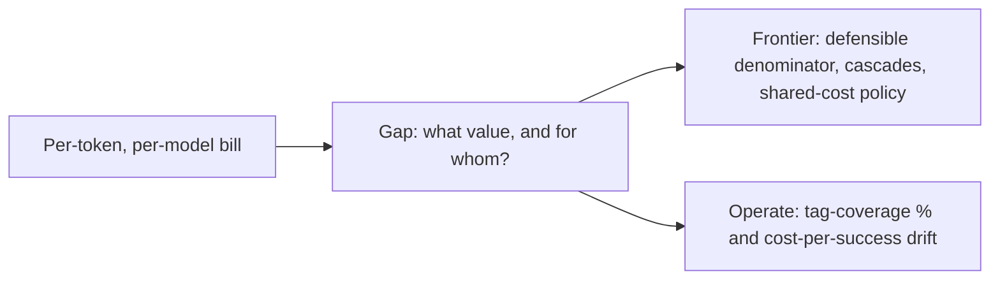

## The frontier & operating cost attribution

**In brief.** The research edge and the production dashboard attack the same gap from two sides: a
per-token, per-model bill tells you **what** you spent, not **what value it bought or who it was
for**. Knowing where the frontier is, and which signals to watch once attribution is live, is what
separates someone who **knows** cost attribution from someone who **runs** it.

**Where the frontier is.**

- **Cost per successful outcome vs. per-token unit economics** — the honest unit is already cost-per-successful-**task**, because retries, abandonment, and over-retrieval all hide inside a per-token number. The frontier pushes one step further: pricing and measuring on the **business outcome** — a resolved ticket, a completed booking — rather than a completed model call. The load-bearing move is choosing a **denominator you can defend end-to-end with hidden costs included**. The genuinely open problem is **predicting per-feature cost before ship**: forecasting against an unknown traffic mix is estimation, not accounting, and rarely survives contact with real traffic.
- **FrugalGPT-style cascades as a cost lever** — route to a cheap model first and **escalate to a stronger one only on low confidence**, measured as **quality per dollar**. It matters for attribution because a cascade **changes what a task costs**: the same feature now bills a mix of cheap-model and frontier-model calls, so spend must roll up across the tiers a single task touched, not per model. The headline cost-reduction figure was model- and price-specific — the durable idea is the routing rule, not the number.
- **Fair allocation of shared, cached, and async cost** — the hard open problem. A cache hit, a shared system prompt, or a background job serves **many tenants and features at once**, and there is **no single correct policy** for splitting it. Provider prompt and prefix caching sharpened this: cached reads bill at a fraction of input price, so the cheap tokens still belong to **some** feature and must be attributed, not dropped. The expert move is naming an **explicit, defensible** rule — split by usage share, charge the requester who warmed the cache, or pool-and-prorate — rather than dumping the cost on one tenant or letting the policy hide silently inside a cache key.

**Signals to watch in production.**

- **Tag-coverage %** — the share of billed spend that carries an actionable attribution tag. This is the **leading indicator**: falling coverage means an untagged async job or a broken retry is dumping real money into the **unattributed bucket**, so every per-feature and per-tenant number is silently understated. You can't optimize what you can't see, and coverage slips **before** any dashboard looks wrong.
- **Cost-per-success by feature or tenant** — the headline operating metric: spend divided by **successful** outcomes, sliced by a dimension you can act on. Drifting up at constant successful-task volume means more wasted spend per delivered outcome — leaking to **retries, abandonment, or over-retrieval**. A zero-success slice is a divide-by-zero you must guard: a feature delivering no value, not a free one.
- **Cache-hit cost savings** — spend avoided by prompt, prefix, and semantic cache hits, attributed back to the features that benefit. Both an optimization scoreboard and the input to the shared-cost allocation policy above; untracked, cached savings silently distort every per-feature number.
- **Cost-per-request trend** — because a "request" fans out into several billed calls once retrieval, tools, and retries are counted, a creeping cost-per-request at constant traffic is the early sign that context is growing or the cascade is escalating more often. Capacity- and budget-planning track the **trend**, not a single month's total.

**Why it matters.** Alert on **tag-coverage** and **cost-per-success drift** — the leading indicators
that attribution or unit economics are slipping — budget-plan on cost-per-request trend and cache-hit
savings, and never reason about spend in "cost per model" when the real currency is **cost per
successful outcome, attributed to a dimension you can act on**.
