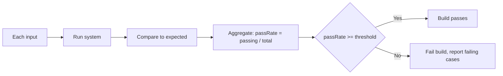

# Build it: an eval gate

## Running a golden set and computing pass rate

A **golden set** is a curated list of cases, each `{ name, input, expected }`. To evaluate a system
you run it on every `input`, compare the output to `expected`, and count how many match. The
**pass rate** is simply `passing / total`.

That single number is what turns "the model feels fine" into something you can track over time and
put in CI. The comparison can be exact equality (as here) or a looser matcher (regex, normalized,
LLM-as-judge) — but the shape is always run → compare → aggregate.

## Gating on a threshold

An eval becomes a **regression gate** when you attach a threshold: the build **passes only if
`passRate >= threshold`**. Drop below it and the gate fails the build, catching a regression before
it ships. Crucially, the gate should also **report which cases failed** (by name) so the failure is
actionable, not just a red number.

Worked example: 3 cases, 2 match → passRate `= 0.667`. With `threshold = 0.9` the gate **fails**
(and reports the one failing case); with `threshold = 0.5` it **passes**.

This is exactly the pattern this very project uses for its `meta-eval` gate on grading skills: run the
calibration cases, measure agreement, and refuse to ship a skill that scores below the bar. An eval
you can't gate on is just a dashboard; a gated eval is a safety net.
