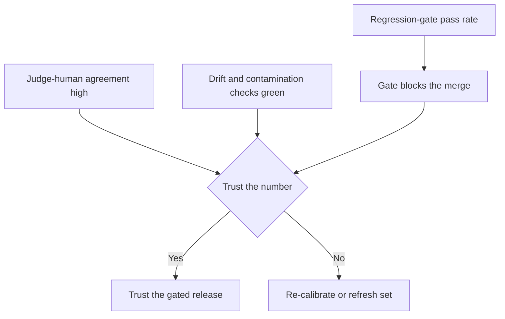

# Eval methodology — the frontier and operating it in production

The deep-dive gave you the levers. This lesson drills the two things that separate someone who *knows*
eval methodology from someone who *runs* it at the frontier: the current research edge, and the
operational signals you watch when an eval suite is live and gating real releases.

## The eval-methodology frontier

Three research directions are where eval work is actually moving right now.

- **LLM-as-judge calibration and bias.** Zheng et al. (LMSYS, 2023) legitimized using a strong model to
  grade outputs — GPT-4 agreed with humans at a rate comparable to human-human agreement — but the same
  work documented the biases that aged into the central caveat: **position bias** (the judge favors the
  first or second answer by order alone), **verbosity bias** (it rewards longer answers regardless of
  quality), and **self-enhancement / self-preference bias** (a judge scores outputs from its own model
  family higher). The frontier question is whether a cheap judge can be *trusted*: the honest move is to
  measure judge-vs-human agreement, swap answer positions to cancel position bias, and control for length
  before letting a judge gate anything. "The judge is strong so it needs no calibration" is the classic
  frontier-level red flag — a judge is an *instrument*, not an *opinion*, only once its agreement is
  measured.

- **Chatbot Arena / Elo as the frontier leaderboard — and its methodology fight.** Chatbot Arena turned
  crowd-sourced **pairwise preference** (which of two answers is better) into an **Elo / Bradley-Terry**
  ranking, and it became the de-facto frontier leaderboard. The load-bearing distinction to carry: this
  is *pairwise* ranking, not the *absolute* per-answer scoring of an MT-Bench-style set — they answer
  different questions. What aged well is the pairwise + Bradley-Terry machinery; what drew serious fire is
  treating one Overall number as procurement-grade truth, once selective disclosure and private-variant
  testing were documented. An expert reads a single leaderboard number as a signal, not a verdict.

- **Benchmark construct validity and contamination.** The frontier is asking whether a benchmark actually
  measures the capability it claims (**construct validity**) and whether apparent gains are memorization
  because the benchmark **leaked into training data** (**contamination**). HELM's answer — Liang et al.
  (Stanford CRFM, 2022) — is a *matrix* of scenario × metric (accuracy, robustness, calibration, bias,
  efficiency) rather than one headline score, and breadth is what exposes construct-validity gaps. The
  operational consequence is that teams increasingly build **private, rotating golden sets** rather than
  chase public leaderboards.

The reason to track this line: all three attack the same failure — a number that looks like quality but
isn't. Calibration attacks a *biased* signal, arena methodology attacks an *over-trusted* signal, and
contamination attacks a *memorized* signal. An expert can say which risk a given eval is exposed to.

## Operating eval methodology in production

When an eval suite is live and gating releases, you don't watch "the eval" — you watch a handful of
signals that tell you whether the quality number you're gating on is still honest.

- **Judge–human agreement rate.** The calibration gauge: measure how often the LLM judge agrees with
  human labels on a held-out calibration set (κ / agreement %). This is what earns the judge the right to
  gate. Falling agreement means the judge has drifted from human intent and its pass rate no longer means
  what you think — re-calibrate before trusting the next gated run.

- **Eval-set drift and contamination checks.** A static golden set silently goes stale as usage moves and
  as cases leak into training data. Watch the freshness loop: are production failures being fed back in
  and de-duplicated, and are held-out/rotating cases run to detect **teaching-to-the-test**? A rising gap
  between offline pass rate and production-canary outcomes is the leading indicator that the set has
  drifted or been contaminated — the offline number rises while real capability doesn't.

- **Regression-gate pass rate (and its trend).** The headline number the CI gate blocks on: the fraction
  of the golden set that passes on each change. It must be computed over the *whole* set, not the
  passed-only slice — a denominator bug turns the gate always-green. A sudden drop blocks the merge; a
  slow creep upward without new held-out cases is a teaching-to-the-test smell, not real progress.

- **Golden-set coverage.** Coverage of the failure modes that matter, not raw case count. Ten thousand
  near-duplicate happy-path cases add cost without signal; a few dozen adversarial cases mined from real
  incidents move the catch-rate far more. Track coverage of known failure modes (injection, ambiguity,
  boundaries) and grow it by failure mining, not volume.

The operational discipline: gate on **regression-gate pass rate**, but only *trust* that number while
**judge–human agreement** stays high and **drift/contamination checks** stay green — and never confuse a
big **golden set** with a well-*covered* one. The real currency of an eval is a calibrated, uncontaminated
signal, not a headline score.

