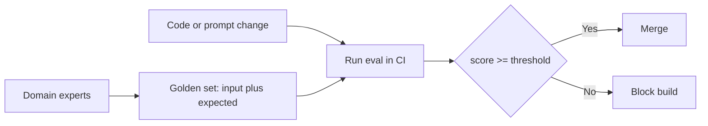

# Evals — golden sets & regression gates

## Why evals are the core discipline

"The outputs look better" is not a measurement. It isn't repeatable, it can't be compared across
changes, and it can't tell an improvement apart from a lateral move that quietly broke something
else. **You can't improve what you don't measure** — so evaluation, not prompt-wording, is the core
discipline of building LLM systems.

An **eval** turns quality into a number you can act on: a fixed, versioned dataset plus a scoring
method. Once you have that, every change becomes a hypothesis you can test ("does this prompt raise
the score?") instead of a vibe you argue about. The antipattern is **vibes-only** evaluation —
eyeballing a handful of outputs — because it catches nothing systematically and hides regressions.

## Golden sets and regression gates

The foundation of an eval is the **golden set**: a curated collection of representative inputs, each
paired with a known-good expected output (or clear acceptance criteria). Humans — usually domain
experts — decide what "correct" means, so the golden set is your **ground truth**.

You then wire the golden set into a **regression gate**: run the eval on *every change* in CI and
fail the build if the score drops below an agreed threshold. This is what stops a fix for one case
from silently breaking three others.

Two failure modes to guard against:

- **Overfitting / teaching to the test** — if you tune prompts against the same small visible set
  until it passes, you optimize the score, not the capability. Keep a **held-out** set the tuner
  never sees, and rotate in fresh cases.
- **Stale sets** — a golden set that never changes stops reflecting real usage. Feed real production
  failures back into it over time.

The golden set plus a regression gate is the baseline discipline every other technique builds on: it
converts arguments about quality into a number CI can block on, which is what makes progress cumulative.
