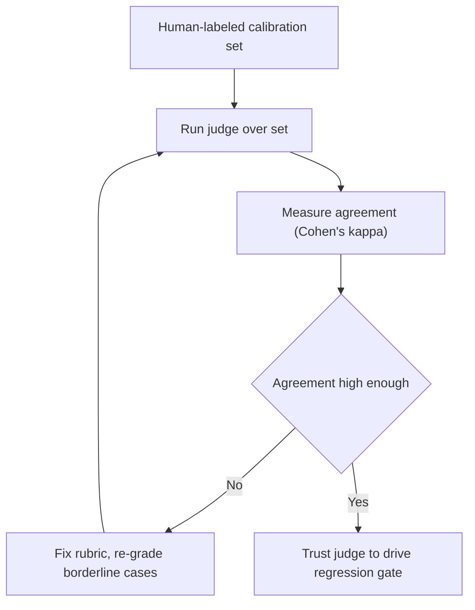

# Evals — LLM-as-judge

## LLM-as-judge rubrics and biases

Deterministic checks (exact match, regex, unit tests) are cheap and unbiased — **use them wherever
they work.** But many outputs are open-ended: a summary, an explanation, a rewrite. There is no
single correct string to match. For those, you can use **LLM-as-judge**: a model grades the output
against a rubric.

The key to a usable judge is **rubric decomposition**. Instead of asking for one holistic 1–10
score, break grading into a handful of independent **true/false checks** ("does it address the
question?", "is it technically correct?", "is it concrete?"). Independent checks are more stable and
far easier to debug than a single opaque number.

A judge is a model, so it inherits **biases** you must control for:

- **Position bias** — favoring whichever answer appears first in a pairwise comparison. Mitigate by
  randomizing order (and averaging both orders).
- **Verbosity / length bias** — treating a longer answer as a better one. Grade against the rubric,
  not length.
- **Self-preference** — favoring outputs in its own family's style.

## Calibrating the judge

An uncalibrated judge is just another opinion — not something you can gate on. **Calibration** means
checking the judge's verdicts against a set of **human-labeled** exemplars and measuring how often
they agree (inter-rater **agreement**, e.g. Cohen's κ).

The workflow: label a calibration set by hand, run the judge over it, and compare. Where the judge
disagrees with humans, fix the rubric. Re-grade **borderline or unstable** cases (best-of-N) and
flag them for human review. Only once agreement is high enough do you trust the judge to drive a
regression gate. Until then, it's a helper, not a gate.

