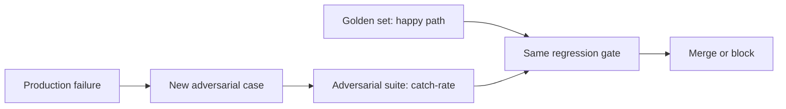

# Eval methodology — adversarial & edge-case coverage roadmap

## Roadmap: adversarial and edge-case coverage

**What this section covers.** Why a golden set that scores 95% can still break in production, and how
an adversarial suite mined from real failures closes the gap by deliberately targeting the edges —
running in the same regression gate as the happy-path set.

**The ideas you'll meet:**

- **Happy path** — the typical inputs a golden set samples, where production failures rarely cluster.
- **Adversarial / red-team suite** — cases that deliberately target where a system is most likely to fail.
- **Prompt injection** — jailbreak and instruction-override attempts the suite probes for.
- **Boundary / edge cases** — empty input, huge input, unusual formats, unexpected languages.
- **Failure mining** — growing the suite from real production failures, so it covers your actual risk.
- **Catch-rate** — the fraction of adversarial cases the system now handles, tracked over time.

**Why it matters.** The golden set proves you didn't regress on normal usage; the adversarial suite
proves you didn't regress on the dangerous edges — and neither one replaces the other.
