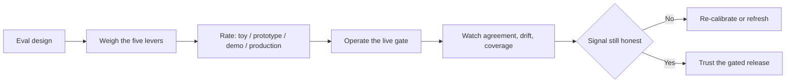

# Eval methodology — design reviews, frontier & ops roadmap

## Roadmap: reviewing designs and operating at the frontier

**What this section covers.** The senior layer: the levers an eval engineer actually pulls and what
each trades away, the canon you cite in an interview, and the signals you watch once a suite is live
and gating real releases.

**The ideas you'll meet:**

- **The five levers** — scoring method, dataset composition, gate placement, judge calibration, and freshness.
- **Common → SOTA → antipattern** — the ladder for holding any eval design from baseline to frontier to failure.
- **MT-Bench** — curated multi-turn questions scored by an LLM judge (absolute scoring).
- **Chatbot Arena / Elo** — crowd-sourced pairwise preference ranked with Bradley-Terry / Elo.
- **HELM** — holistic evaluation as a matrix of scenario × metric, not one leaderboard number.
- **Construct validity** — whether a benchmark actually measures the capability it claims.
- **Contamination** — benchmark data leaking into training, so gains are memorization.
- **Operational signals** — judge–human agreement, eval-set drift, gate pass-rate trend, and coverage.

**Why it matters.** Naming a lever, its cost, and the regime where it wins — and knowing which signal
tells you the number has gone dishonest — is exactly what reads as senior in a design review or interview.
