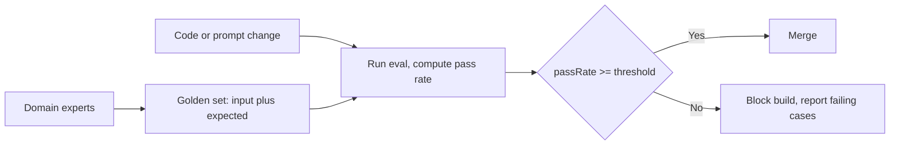

# Eval methodology — golden sets & regression gates roadmap

## Roadmap: golden sets and regression gates

**What this section covers.** The foundation of the whole discipline: turning "the outputs look
better" into a number by pairing a curated ground-truth dataset with a scoring method, then wiring
that number into a CI gate that blocks a merge when quality drops — and building one in code.

**The ideas you'll meet:**

- **Eval** — a fixed, versioned dataset plus a scoring method that turns quality into a number you can act on.
- **Golden set** — a curated collection of representative inputs each paired with a known-good expected output.
- **Ground truth** — the human, usually domain-expert, decision about what "correct" means.
- **Regression gate** — run the eval on every change and fail the build if the score drops below a threshold.
- **Pass rate** — `passing / total`, the single number the gate compares against the threshold.
- **Threshold** — the agreed bar the pass rate must clear for the build to pass.
- **Held-out set** — cases the tuner never sees, so a rising score reflects capability, not memorization.
- **Overfitting / teaching to the test** — tuning against the same visible cases until they pass, optimizing the score not the capability.
- **Stale set** — a golden set that never changes and stops reflecting real usage.
- **Vibes-only** — eyeballing a handful of outputs; the antipattern this whole section replaces.

**Why it matters.** Every other technique — adversarial coverage, LLM-as-judge, production ops —
assumes this baseline exists; without a fixed dataset and a gate, you are shipping on vibes.
