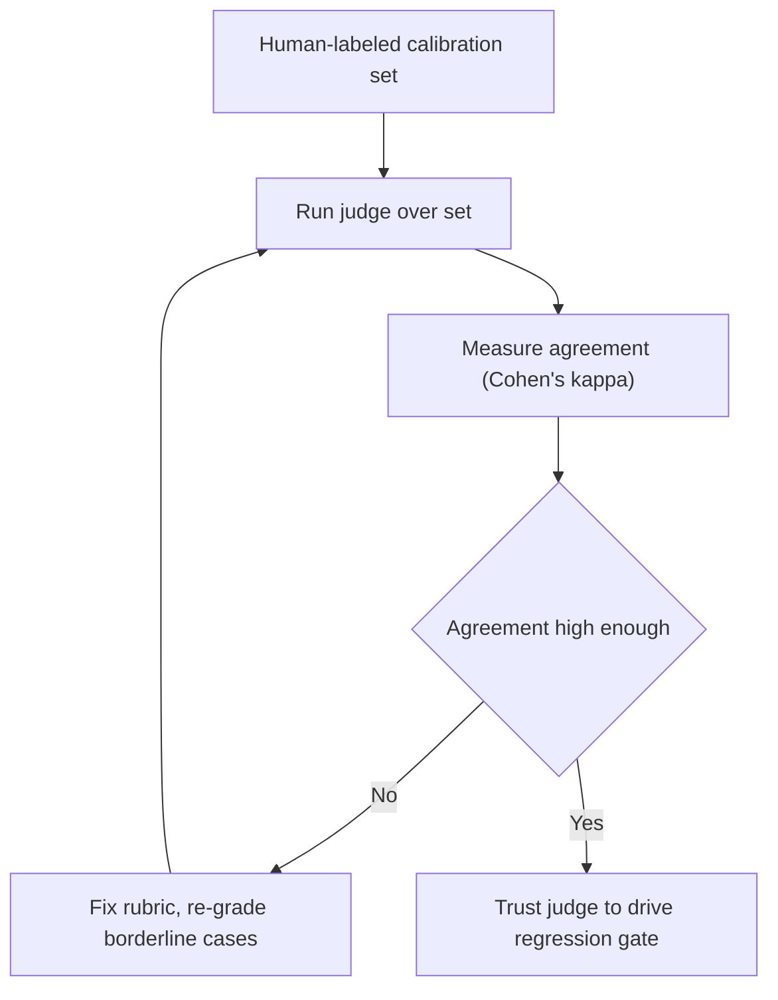

# Eval methodology — LLM-as-judge roadmap

## Roadmap: LLM-as-judge

**What this section covers.** How to score open-ended outputs where no single correct string exists:
decompose a rubric into independent true/false checks, control for the biases a model judge inherits,
and calibrate its verdicts against human labels before you ever let it drive a gate.

**The ideas you'll meet:**

- **LLM-as-judge** — a model grades an output against a rubric where exact match cannot.
- **Rubric decomposition** — breaking grading into independent true/false checks instead of one holistic score.
- **Position bias** — favoring whichever answer appears first; cancel it by randomizing order.
- **Verbosity / length bias** — treating a longer answer as a better one.
- **Self-preference** — favoring outputs in the judge's own family's style.
- **Calibration** — checking the judge's verdicts against human-labeled exemplars.
- **Agreement (Cohen's κ)** — how often judge and human verdicts match; what earns the judge the right to gate.
- **Borderline cases** — unstable verdicts re-graded (best-of-N) and flagged for human review.

**Why it matters.** An uncalibrated judge is just another opinion; only measured human agreement turns
it into an instrument you can gate a release on.
