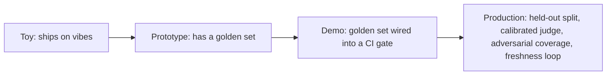

## Reviewing an eval design

**In brief.** Every eval decision is really a decision about **how trustworthy a quality signal you
get, and at what labeling cost, latency, and risk of gaming**. Reviewing one — in a design doc or an
interview — means walking five levers and refusing to trust a number that was never measured against
ground truth.

**The five levers.**

- **Scoring method** — **deterministic checks** (exact match, regex, schema, unit assertions) versus **model-graded** (LLM-as-judge) versus **human labels**. Deterministic is cheap, unbiased, repeatable, and effectively free in tokens, but only works where correctness is a string or a predicate. A judge scales to open-ended text but adds bias and a recurring token bill. Humans are ground truth but don't scale to every commit.
- **Dataset composition** — a happy-path **golden set** anchors typical behavior, an **adversarial** suite samples the failure modes production actually hits (injection, ambiguity, boundaries), and a **held-out** rotation is what detects teaching-to-the-test.
- **Gate placement** — **local**, a **CI regression gate**, or a **canary** in production. Earlier gates are cheaper and block bad changes before they land; canaries catch what offline sets miss.
- **Judge calibration** — the lever is whether you have measured judge-versus-human agreement (e.g. κ) before letting the judge gate. Uncalibrated, it is an **opinion**; calibrated, it is an **instrument**. Calibration is a fixed up-front cost, re-paid only when the judge model or rubric changes — not a per-run one.
- **Freshness** — a **static** set frozen at authoring time versus a **living** one fed from real production failures. Static sets go stale; living sets stay honest but need curation and de-duplication.

**The review checklist.**

- **Is there a fixed, versioned dataset at all?** If quality is judged by eyeballing a fresh handful of outputs each release, stop there — it isn't repeatable, can't compare changes, and hides regressions. The fix is a golden set wired into a gate, not more reviewers or a different sample size.
- **Deterministic where it can be?** A judge or a human used where an exact-match or schema check would work is wasted cost and added bias.
- **Is anything held out?** Tuning against the same visible cases with nothing held out optimizes the score, not the capability. A perfect score on a small static set is the **symptom**, not the proof — the guard is a held-out or rotating split the tuner never sees, plus real failures fed back in. Set size is not the issue.
- **Is the judge calibrated?** Gating on an unmeasured judge bakes its position, verbosity, and self-preference biases straight into the release process. Raising the threshold or swapping in a bigger judge model does not make an uncalibrated verdict trustworthy — only measured agreement against human labels does.
- **Does it cover failure modes, and stay fresh?** A happy-path-only, never-rotated set passes in CI and breaks in production.

**Why it matters.** These five checks place any eval design on the toy → prototype → demo → production
ladder in minutes, and they name the red flags that sink a candidate: shipping on **vibes**, **teaching
to the test**, trusting an **uncalibrated judge**, and letting a golden set go **stale**. The senior
move is to name the lever, name what it costs, and name the regime where it wins — "just have an LLM
grade it", with no biases named and no human calibration, signals shallow depth.
