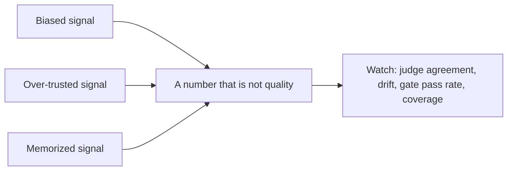

## The frontier & operating a live eval suite

**In brief.** The research edge and the production dashboard attack the same failure from two sides:
**a number that looks like quality but isn't**. Calibration attacks a **biased** signal, arena
methodology attacks an **over-trusted** signal, and contamination attacks a **memorized** signal — and
once a suite is live, a handful of operational signals tell you which one you're exposed to.

**Where the frontier is.**

- **Judge calibration and bias.** Zheng et al. (LMSYS, 2023) legitimized LLM-as-judge — GPT-4 agreed with humans at a rate comparable to human-human agreement — and shipped two vehicles with it: **MT-Bench** (curated multi-turn questions scored by an LLM judge) and **Chatbot Arena** (crowd-sourced pairwise Elo battles). The same work documented the biases that aged into the central caveat: **position bias** (favoring an answer by order alone), **verbosity bias** (rewarding length regardless of quality), and **self-enhancement or self-preference bias** (scoring its own model family higher). The honest controls are to measure judge-versus-human agreement, swap answer positions to cancel position bias, and control for length. "The judge is strong so it needs no calibration" is the frontier-level red flag — and note the neighbouring canon is distinct: **HELM** is Liang et al. at Stanford CRFM, while RAGAS and BEIR are retrieval-side.
- **Chatbot Arena, Elo, and its methodology fight.** Arena turns crowd-sourced **pairwise preference** — which of two answers is better — into an **Elo or Bradley-Terry** ranking. The load-bearing distinction: this is **pairwise ranking**, not the **absolute per-answer scoring** of an MT-Bench-style set. They answer different questions. The pairwise plus Bradley-Terry machinery aged well; what drew serious fire is treating one Overall number as procurement-grade truth. An expert reads a single leaderboard number as a signal, not a verdict.
- **Construct validity and contamination.** **Construct validity** asks whether a benchmark actually measures the capability it claims. **Contamination** asks whether apparent gains are memorization because the benchmark leaked into training data — the diagnosis when a public benchmark climbs month over month without real capability behind it. HELM's answer is a **matrix of scenario × metric** (accuracy, robustness, calibration, bias, efficiency) rather than one headline score, and that breadth is what exposes validity gaps. The operational consequence: build **private, rotating held-out sets** rather than chase a public leaderboard.

**Signals to watch in production.**

- **Judge–human agreement rate** — κ or agreement percent on a **held-out calibration set**. This is what earns the judge the right to gate. A **drop** means the judge has drifted from human intent, so its pass rate no longer means what you think — re-calibrate before trusting the next gated run. Token spend, case count, and wall-clock run time are not calibration.
- **Eval-set drift and contamination checks** — a **rising gap between offline pass rate and production-canary outcomes** is the leading indicator that the set is stale or contaminated: the offline number rises while real capability doesn't, which is drift or teaching-to-the-test. The fix is the freshness loop — held-out and rotating cases, plus production failures fed back in and de-duplicated.
- **Regression-gate pass rate and its trend** — the headline number CI blocks on, computed over the **whole** set, not the passed-only slice; a denominator bug turns the gate always-green. A sudden drop blocks the merge; a slow creep upward with no new held-out cases is a teaching-to-the-test smell, not progress.
- **Golden-set coverage** — coverage of the **failure modes that matter**, not raw case count. Ten thousand near-duplicate happy-path cases add cost without signal; a few dozen adversarial cases mined from real incidents move the catch-rate far more. Grow coverage by failure mining, not volume.

**Why it matters.** Gate on **regression-gate pass rate**, but only trust that number while
**judge–human agreement** stays high and **drift and contamination checks** stay green — and never
confuse a big golden set with a well-covered one. The real currency of an eval is a calibrated,
uncontaminated signal, not a headline score.
