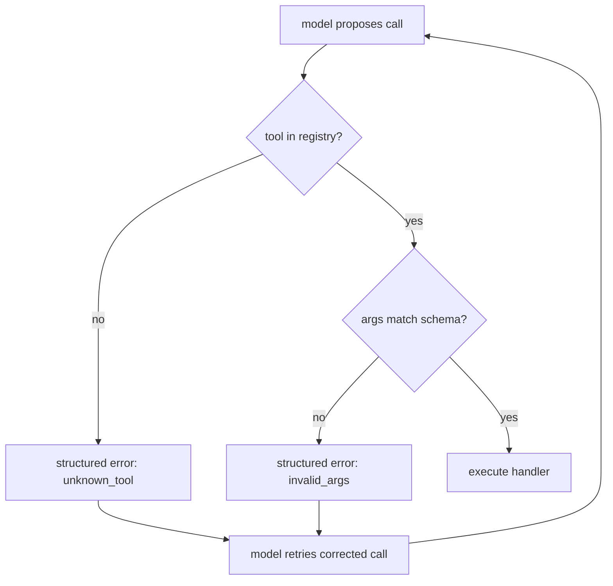

# Function-calling reliability — validation & hallucinated calls

## Validate before you execute

The model **proposes** a tool call; it does not get to **execute** one. Between the proposal and the
side effect sits the harness's dispatcher, and its first job is **argument validation**: check the
proposed call against the tool's schema before anything runs.

Validation catches two distinct failures:

- **Unknown tool** — the model names a tool that isn't in the registry. This is a *hallucinated
  call*. The dispatcher must **reject** it; it must never guess the "closest" real tool or execute
  something the model didn't actually ask for.
- **Invalid arguments** — a known tool called with a required field missing, or a wrong type. The
  dispatcher fails schema validation instead of running the tool with garbage input.

The antipattern is executing unvalidated arguments: silently filling in defaults, blindly coercing a
string to a number, or trusting the tool name without checking the registry.

## Return a model-facing error

Rejecting a bad call is only half the job. The dispatcher should return a **structured,
model-facing error** describing exactly what was wrong — "unknown tool `deleteAllUsers`" or "field
`amount` is required and must be an integer."

That error goes back into the loop so the model can **retry with a corrected call**. Crashing the
session or silently dropping the call gives the model nothing to recover from. Well-designed errors
turn a hallucinated or malformed call into a self-correcting step rather than a failure.

Validation matters because it is the single seam where an untrusted caller is held to the contract —
without it, a hallucinated or malformed call becomes a wrong side effect instead of a self-correcting retry.
