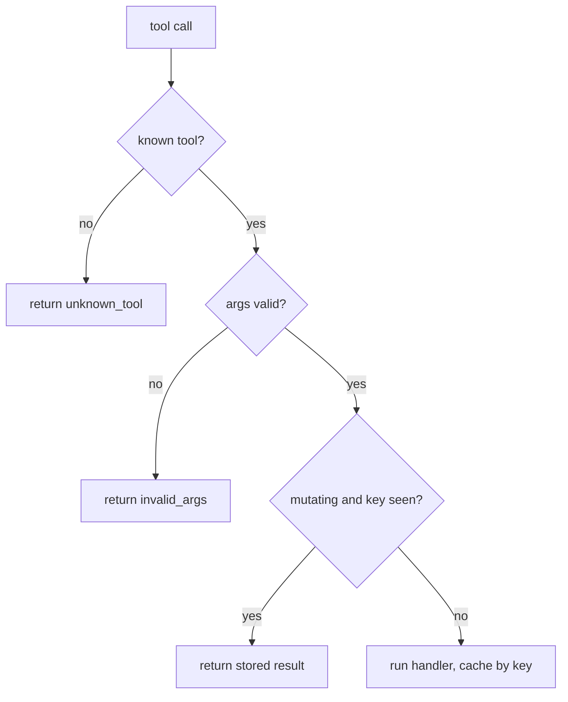

# Build it: a validating, idempotent dispatcher

## Tools are APIs validate before you execute

A tool call coming from the model is **untrusted input** — the model can name a tool that doesn't
exist or pass arguments that don't fit. The dispatcher's job is to be the strict API gateway in front
of your tools, in this order:

1. **Tool exists?** If the model calls an unknown/hallucinated tool, **return a structured error**
   (e.g. `{ ok: false, error: "unknown_tool" }`) — do **not** throw. A structured error is something
   the agent can read and recover from; an exception just crashes the turn.
2. **Arguments valid?** If the tool declares a validator and the args fail it, reject with
   `invalid_args` **before** running the handler. Never execute on unvalidated arguments.
3. **Only then execute.** With a known tool and valid args, run the handler.

## Idempotency for safe retries

Once a tool has **side effects** (charging a card, sending an email), a retry — or a model that emits
the same call twice — must not apply the effect twice. The fix is an **idempotency key**:

- For a **mutating** tool called with a key you've already processed, return the **stored prior
  result** instead of running the handler again (dedupe).
- **Read-only** tools don't need this — repeating a read is harmless, so they aren't deduped.

Worked flow: `charge({amount: 10}, key="k1")` runs the handler once and caches its result; a retry
`charge({amount: 10}, key="k1")` returns that same cached result **without charging again**. That's
what makes "just retry on failure" safe in the presence of side effects.
