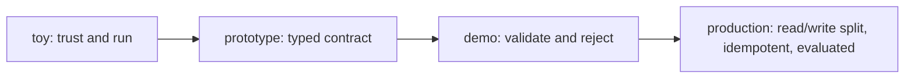

# Function calling — architecture, tradeoffs, and reviewing a design

You already know the pieces: a tool is an API with a typed contract, arguments are validated before
any side effect, mutating tools carry idempotency keys, and hallucinated calls are rejected with a
structured error. This lesson zooms out to the **design space**: the levers a reliability engineer
actually pulls when they build a function-calling layer, what each one trades away, and how to judge
someone else's design the way an interviewer or a staff engineer in a review would.

## The function-calling-reliability design space

Every function-calling decision is really a decision about **what happens between the model
proposing a call and the world changing** — and how much you trust the model's output along the way.
There are five independent levers, and real systems combine them:

- **Contract typing** — how tightly each tool's arguments are specified. A loose contract (free-form
  string args, "the model will figure it out") pushes failure into runtime; a **typed schema**
  (JSON Schema / Zod / Pydantic) makes the contract machine-checkable so malformed calls become
  rejectable errors before execution.
- **Validation strictness** — what the dispatcher does with a proposed call. The lever runs from
  *trust-and-run* (execute whatever the model emits) through *coerce* (silently default or cast) to
  *validate-and-reject* (fail closed on unknown tools or bad arguments, return a model-facing error).
- **Side-effect classification** — whether tools are split by **read vs. write**. Reads auto-run and
  retry freely; writes deserve confirmation gates, stricter validation, and idempotency. Without this
  split you cannot answer "is this safe to auto-run?" or "is this safe to retry?"
- **Idempotency / exactly-once** — how you protect mutations from the **duplicate-effect** risk. The
  lever runs from *no protection* through *idempotency keys* (record the first outcome, return it on
  retry) toward the hard, unsolved end of *exactly-once at scale*.
- **Tool-boundary standardization** — whether tools are wired per-vendor or exposed over a common
  interface (**MCP**). Standardizing the boundary buys reuse and a single validation/observability
  seam at the cost of adopting a protocol.

## A tradeoff table for function-calling-reliability

| Strategy | Buys you | Costs you | Reach for it when |
|---|---|---|---|
| Loose / untyped tool args | Fast to prototype, no schema to write | Malformed calls fail at runtime with undefined behavior; no machine check | Throwaway demo, single trusted caller |
| Typed contract (JSON Schema / Zod / Pydantic) | Machine-checkable args, reject before side effect, clear model-facing errors | Schema authoring and maintenance per tool | Any tool that touches real state |
| Validate-and-reject dispatcher | Hallucinated/invalid calls become self-correcting retries, never execute garbage | Must design structured error contract + retry loop | Any production function-calling layer |
| Read/write separation | Lets reads auto-run, gates and protects writes distinctly | Every tool must be classified; policy per class | As soon as any tool mutates state |
| Idempotency keys | Retries after a lost response don't double-apply the effect | Server-side key store, dedupe bookkeeping, key-generation discipline | Mutating tools in a retrying agent loop |
| MCP as tool boundary | Tool built once works across hosts; one validation/observability seam | Adopt and conform to the protocol | Many tools shared across apps/vendors |

The table is the interview answer in miniature: **name the lever, name what it costs, name the
regime where it wins.** A candidate who says "just let the model call the tools" without naming
validation, the read/write split, and idempotency is signalling shallow depth.

## Common, SOTA, and antipattern

A useful way to hold any subsystem is the **common → SOTA → antipattern** ladder.

- **Common (works, ships everywhere):** a typed schema per tool, a dispatcher that validates
  arguments and rejects unknown tools with a structured error, and read/write separation so reads
  auto-run. This is the sensible baseline every reliable harness should start from.
- **SOTA (frontier, worth reaching for under real pressure):** the above **plus** idempotency keys on
  every mutating tool with read/write separation, **plus** MCP as the standardized tool boundary so a
  tool is implemented once and reused, **plus** evaluating tool-calling ability against **Gorilla /
  the Berkeley Function-Calling Leaderboard** rather than trusting vibes. The frontier is treating the
  tool boundary as a validated, evaluated, standardized API — and pushing toward reliable multi-tool
  orchestration, robust argument grounding, and exactly-once execution at scale, which remain open.
- **Antipattern (looks fine, fails in production):** **executing unvalidated arguments** (silent
  defaulting or blind coercion); **trusting the tool name blindly** and running the "closest" real
  tool for a hallucinated one; **non-idempotent mutations** that a retry double-applies; and
  success-only handling with no model-facing error path so a bad call crashes the loop instead of
  self-correcting. Each of these passes a demo and corrupts state or double-charges under real
  traffic.

## Scaling, performance, and the token budget

The forces that make this concrete once you are past a single tool and a single request:

- **Every tool schema costs context tokens.** Each tool definition — names, types, descriptions —
  rides in the prompt on every call. A registry of dozens of verbose tools eats the budget and *also*
  degrades selection accuracy, because the model must pick from a longer menu. Trim descriptions and,
  past a threshold, retrieve or scope the tool set per request instead of sending all of it.
- **Validation is cheap; a wrong side effect is not.** Schema validation is microseconds; a
  double-charge or a wrongful delete is an incident. The asymmetry is why you always **validate
  before executing** rather than optimizing the check away.
- **Retries multiply calls, so idempotency scales the mutation, not the request.** In a retrying
  loop the same mutating call may be issued several times. Idempotency keys make N identical retries
  converge on one effect; without them, throughput of *retries* becomes throughput of *duplicate
  effects*.
- **Standardization amortizes the seam.** With MCP the validation, error, and observability logic
  lives once at the boundary instead of being re-implemented per tool integration — the win grows
  with the number of tools and hosts sharing that boundary.

## Reviewing a function-calling-reliability design

When you are handed a function-calling design to critique — in a review or an interview — walk the
same checklist:

1. **Is every tool a typed contract?** Free-form or untyped arguments are an immediate flag; the
   plan will fail at runtime with undefined behavior.
2. **What does the dispatcher do with a bad call?** No validation, or silent coercion/defaulting, or
   running the "closest" tool for a hallucinated name, all mean executing unvalidated input.
3. **Are reads and writes separated?** Without a side-effect class you cannot safely decide what
   auto-runs or what is safe to retry.
4. **Are mutations idempotent?** A mutating tool with no idempotency key in a retrying loop carries
   the duplicate-effect risk — the classic double-charge.
5. **What does the model see on failure?** A real design returns a **structured, model-facing error**
   so the loop self-corrects, and names how the capability is evaluated (Gorilla / Berkeley
   Function-Calling Leaderboard) and whether the boundary is standardized (MCP) — never "it just
   works."

Rating a design as **toy / prototype / demo-ready / production-ready** comes down to how many of
these it answers. A toy trusts and runs whatever the model emits; a prototype adds a typed contract;
a demo validates and rejects with model-facing errors; a production-ready design also separates
read from write, makes every mutation idempotent, and evaluates tool-calling against a real
benchmark rather than vibes.

