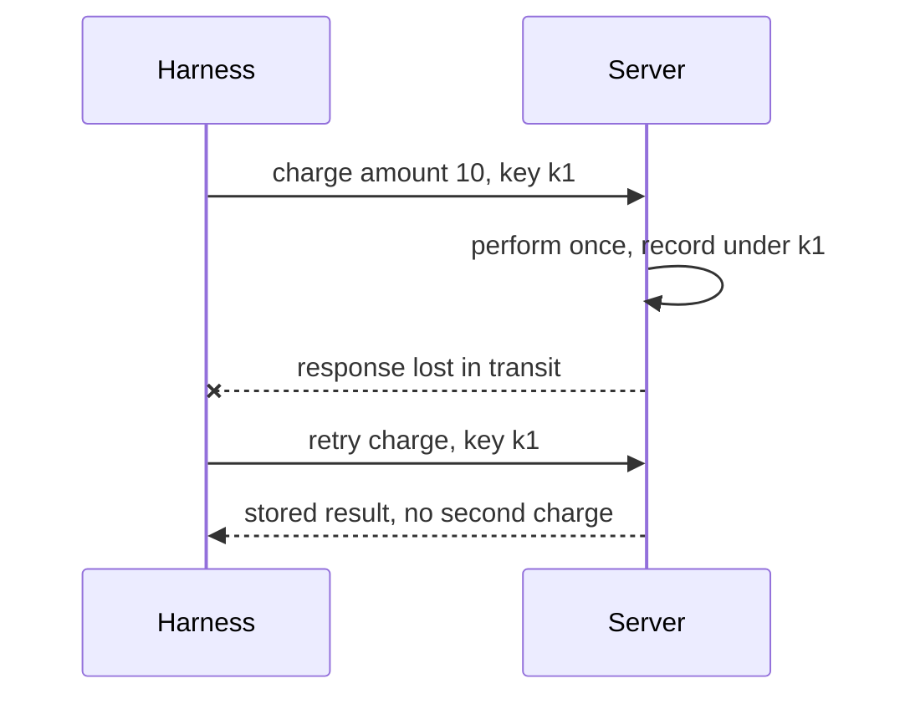

# Function-calling reliability — idempotency & safe retries

## Why retries are dangerous

Agent loops retry. Calls time out, connections drop, and the harness re-issues the request. For a
read that is harmless. For a **mutating** tool it can be catastrophic.

Consider `chargeCard`. The harness sends the call, the charge actually succeeds on the server, but
the response is lost in transit. From the harness's point of view the call "failed," so it retries —
and the customer is charged **twice**. This is the **duplicate-effect** risk, and it is the defining
hazard of non-idempotent mutations.

## Idempotency makes retries safe

An operation is **idempotent** when performing it more than once has the same effect as performing
it once. Idempotency is exactly the property that makes a retry safe: repeating the call converges on
the same end state instead of stacking side effects.

The standard mechanism is an **idempotency key**:

- The client sends a unique key with the mutating request.
- On first use, the server performs the operation and **records the outcome under that key**.
- Any identical retry with the same key returns the **stored result** instead of re-applying the
  effect.

Combined with **read/write separation** — reads retry freely, writes carry keys and confirmation
gates — idempotency keys turn a fragile, double-charging tool into one that is safe to retry. The
rule of thumb: never make a mutating tool retryable until repeating its call is provably harmless.
