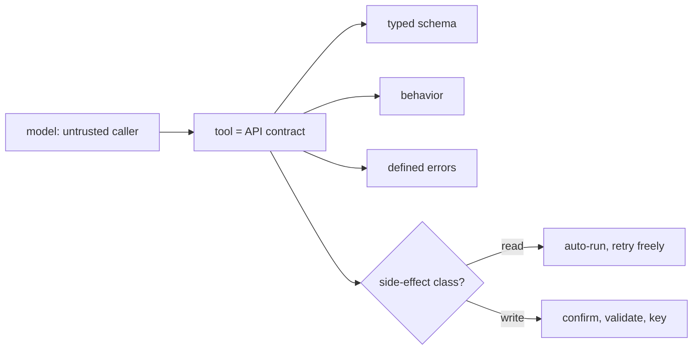

# Function-calling reliability — tool-contract roadmap

## Roadmap: tool contracts

**What this section covers.** How to treat a tool not as a hint the model interprets but as a
published **API with a contract** — a typed schema, defined behavior, and defined errors — where the
model is just one more untrusted caller, and how classifying each tool by its side-effect class sets
the policy for everything that follows.

**The ideas you'll meet:**

- **Contract** — a tool's published promise: a typed schema of arguments, a defined behavior, and a defined set of errors.
- **Schema** — JSON Schema / Zod / Pydantic naming every argument, its type, and whether it is required; the machine-checkable part of the contract.
- **Untrusted caller** — the stance that the model's proposed call is input to be checked, never trusted, exactly like a web API treats any request.
- **Side-effect class** — read-only vs. write/mutating; the classification that decides what may auto-run and what needs gates and idempotency.

**Why it matters.** The contract and the read/write split are the foundation every later
reliability move rests on — you can only decide "safe to auto-run?" or "safe to retry?" once each
tool is a typed API with a known side-effect class.
