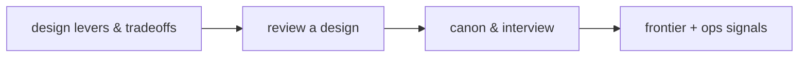

# Function-calling reliability — frontier roadmap

## Roadmap: design tradeoffs and the frontier

**What this section covers.** Zooming out from the mechanics to the **design space** a reliability
engineer actually reasons about — the levers and what each trades away, how to review a design the way
an interviewer would, the short canon behind the field, and the research frontier plus the production
signals you watch when tool calling is live.

**The ideas you'll meet:**

- **Design levers** — contract typing, validation strictness, side-effect classification, idempotency, and tool-boundary standardization; each buys something and costs something.
- **common -> SOTA -> antipattern** — the ladder for holding any subsystem, from the sensible baseline to the frontier to the failure mode that looks fine and breaks in production.
- **Reviewing a design** — rating a plan toy / prototype / demo / production-ready by how many reliability questions it answers.
- **The canon** — Toolformer, Gorilla, and MCP: tool use as a learnable capability, evaluated against large API surfaces, over a standardized boundary.
- **Berkeley Function-Calling Leaderboard** — the reference benchmark that scores argument correctness and call structure, making reliability an evaluated property.
- **Open problems** — reliable multi-tool orchestration, robust argument grounding, and exactly-once execution at scale.
- **Ops signals** — validation-failure rate, unknown-tool rate, duplicate-execution rate, and per-tool latency: what you watch in production.

**Why it matters.** Knowing the canon *and* the safety mechanics — and being able to name the lever,
its cost, and the regime where it wins — is what reads as senior in a design review or an interview.
