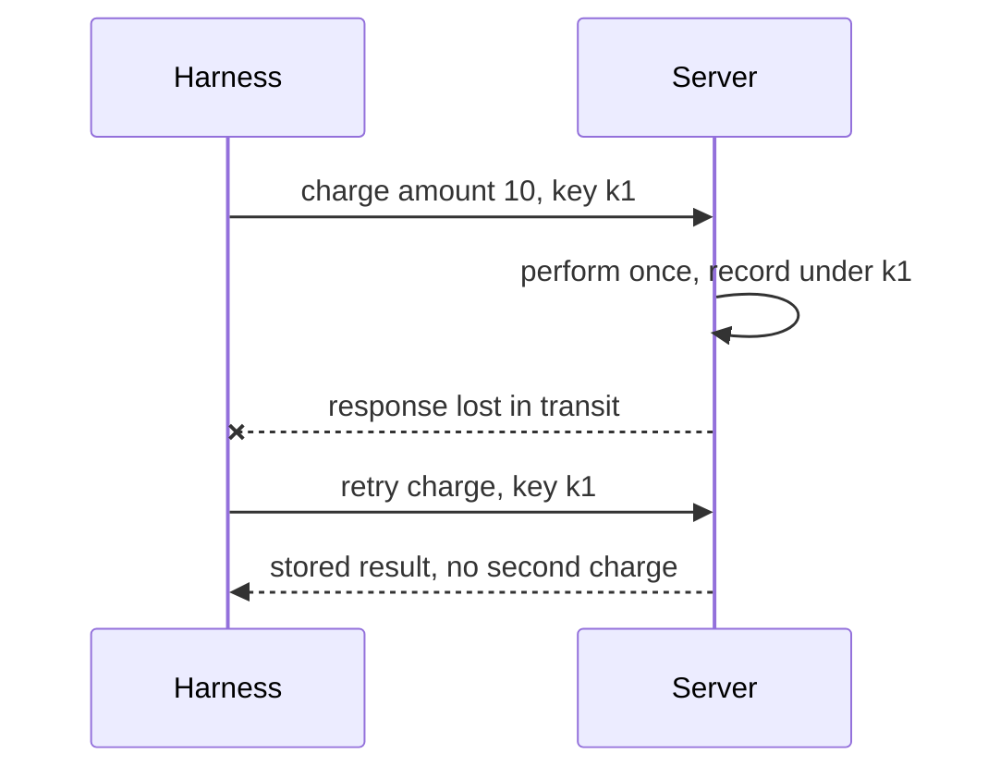

# Function-calling reliability — idempotency roadmap

## Roadmap: idempotency and safe retries

**What this section covers.** Why agent loops retry, why retrying a **mutating** call can double-apply
its effect, and how idempotency keys plus dedupe make "just retry on failure" safe — the same logic
built into a real dispatcher that validates, then deduplicates before it executes.

**The ideas you'll meet:**

- **Duplicate-effect risk** — a retried mutating call whose first response was lost, applying the effect twice; the classic double-charge.
- **Idempotency** — the property that performing an operation more than once has the same effect as performing it once.
- **Idempotency key** — a unique token sent with a mutating request; the server records the first outcome under it and returns that on any retry.
- **Dedupe (stored result)** — returning the cached prior result for a key already seen, instead of re-running the handler.
- **Safe retry** — the guarantee that repeating a call converges on one end state; reads retry freely, writes carry keys.

**Why it matters.** Idempotency is exactly the property that makes retries safe in the presence of
side effects — the rule of thumb is never to make a mutating tool retryable until repeating its call
is provably harmless.
