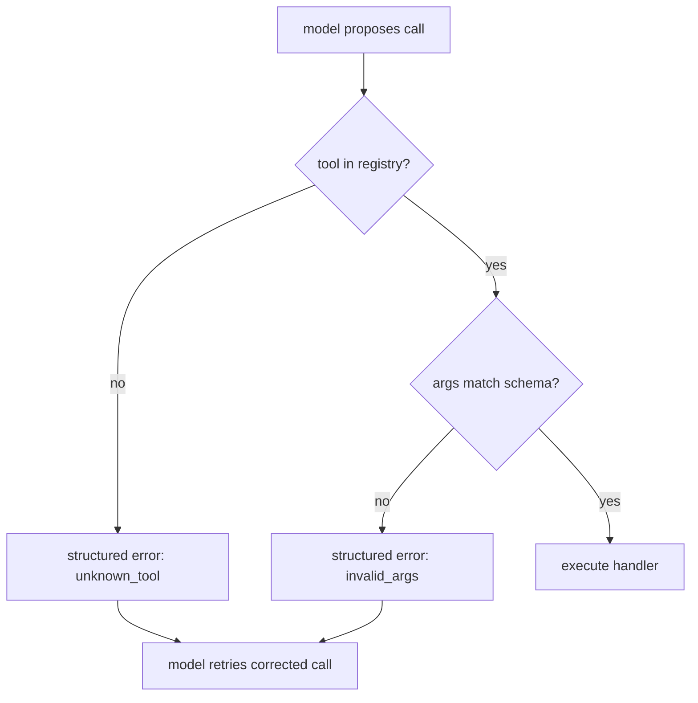

# Function-calling reliability — validation roadmap

## Roadmap: argument validation

**What this section covers.** What the dispatcher does between the model **proposing** a call and
the side effect running — validating the proposed call against the contract, rejecting hallucinated
tools and malformed arguments, and returning a structured error the model can read and correct.

**The ideas you'll meet:**

- **Argument validation** — checking a proposed call against the tool's schema before anything runs; the dispatcher's first job.
- **Hallucinated call** — the model naming a tool that isn't in the registry; it must be rejected, never mapped to the "closest" real tool.
- **Invalid arguments** — a known tool called with a required field missing or a wrong type; fails schema validation instead of running on garbage.
- **Model-facing error** — a structured message describing exactly what was wrong, fed back so the model can retry with a corrected call.
- **Validate-and-reject** — failing closed on bad calls rather than the antipattern of silently defaulting, coercing, or trusting the tool name.

**Why it matters.** Validation is what turns a hallucinated or malformed call into a self-correcting
step rather than a crash or a wrong side effect — it is the seam where an untrusted caller is held to
the contract.
