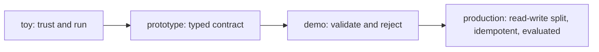

## Reviewing a function-calling design

**In brief.** Every function-calling decision is really a decision about what happens between the
model **proposing** a call and the world changing — and how much you trust the model's output along
the way. Reviewing a design means walking five independent levers and naming, for each, what it buys
and what it costs.

**The five levers.**

- **Contract typing** — how tightly each tool's arguments are specified. A loose contract (free-form string args, "the model will format the arguments correctly") is fast to prototype with no schema to write, but it pushes failure into runtime as **undefined behavior with no machine check**. A typed schema (JSON Schema / Zod / Pydantic) makes arguments machine-checkable so a malformed call becomes a rejectable error before any side effect — at the cost of authoring and maintaining a schema per tool.
- **Validation strictness** — what the dispatcher does with a proposed call. The lever runs from **trust-and-run** (execute whatever the model emits), through **coerce** (silently default or cast), to **validate-and-reject** (fail closed on unknown tools or bad arguments and return a model-facing error). Validate-and-reject costs you a structured error contract plus a retry loop, and buys self-correcting retries instead of executed garbage.
- **Side-effect classification** — whether tools are split by **read vs. write**. Reads auto-run and retry freely; writes deserve confirmation gates, stricter validation, and idempotency. Every tool must be classified and each class needs its own policy — but without the split you cannot answer "is this safe to auto-run?" or "is this safe to retry?"
- **Idempotency and exactly-once** — how mutations are protected from the **duplicate-effect** risk. The lever runs from no protection, through **idempotency keys** (record the first outcome, return it on retry), toward the hard, unsolved end of exactly-once at scale. Keys cost a server-side key store, dedupe bookkeeping, and key-generation discipline.
- **Tool-boundary standardization** — per-vendor wiring versus a common interface (**MCP**). Standardizing buys reuse and a single validation and observability seam at the cost of adopting a protocol; the win grows with the number of tools and hosts sharing that boundary.

**The dispatcher's order of operations.**

- **Tool exists?** An unknown or hallucinated tool name returns a **structured error** (e.g. `unknown_tool`) — it does not throw. A structured error is something the agent can read and recover from; an exception just crashes the turn. Never guess the "closest" registered tool: that runs an operation the model never asked for and hides the hallucination.
- **Arguments valid?** If the tool declares a validator and the args fail it, reject with `invalid_args` **before** running the handler. Silently defaulting a missing field or blindly coercing a type is executing unvalidated arguments.
- **Mutating and key already seen?** Return the **stored prior result** rather than re-running the handler. Read-only tools are not deduped — repeating a read is harmless.
- **Only then execute** the handler, caching its result under the key.

**The review checklist.**

- Is every tool a typed contract? Free-form or untyped arguments are an immediate flag — the plan will fail at runtime with undefined behavior instead of producing a rejectable error.
- What does the dispatcher do with a bad call? No validation, silent coercion or defaulting, or running the "closest" tool for a hallucinated name all mean executing unvalidated input. A design that "never fails a call" is toy-grade, not resilient.
- Are reads and writes separated, so you can decide what auto-runs and what is safe to retry?
- Are mutations idempotent? A mutating tool retried inside a loop carries the duplicate-effect risk: the effect lands, the response is lost, the retry applies it again — a double charge or a double refund. The fix is an idempotency key plus read/write separation **before** enabling retries, not banning retries outright.
- What does the model see on failure? A real design returns a **structured, model-facing error** so the loop self-corrects, names how the capability is evaluated (**Gorilla** and the **Berkeley Function-Calling Leaderboard**), and says whether the boundary is standardized (**MCP**) — never "it just works."

**Why it matters.** These checks rate any design toy / prototype / demo-ready / production-ready by
how many of them it answers, and they name the antipatterns that sink a review: executing
unvalidated arguments, trusting tool names blindly, and non-idempotent mutations — each of which
passes a demo and corrupts state or double-charges under real traffic.
