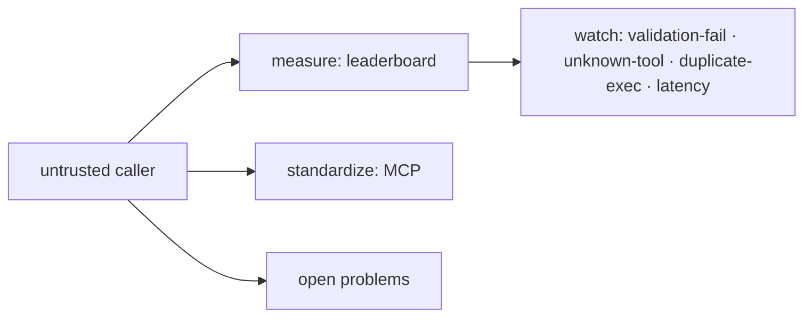

## The frontier & operating tool calls in production

**In brief.** The research edge and the production dashboard attack the same gap from two sides: the
model is an **untrusted caller**. The frontier measures whether calls are correct, standardizes where
the contract is checked, and pushes on the hard cases; operations watch a handful of signals that say
whether the dispatcher is healthy and where the next reliability wall is.

**Where the frontier is.**

- **Making tool calling measurable** — the **Berkeley Function-Calling Leaderboard** is the frontier's scoreboard. It evaluates **argument correctness and call structure** across models, not vibes, and increasingly across harder call shapes such as parallel and streaming tool calls. The load-bearing idea: reliability is an **evaluated** property, so an expert regression-tests their own dispatcher against a fixed set the way the leaderboard scores a model, rather than trusting that it "usually" calls the right tool. Latency and the model's confidence in its choice are not what it scores.
- **Standardizing the tool boundary** — **MCP** (Model Context Protocol, Anthropic, 2024) is the open standard for **where the contract lives**. Its significance is structural: it moves tool discovery, scoping, and validation to a **single shared seam**, so a tool is implemented, validated, and observed once instead of re-wired and re-checked per vendor. It does not stop the model hallucinating, does not remove the need to validate, does not make schemas free of context tokens, and does not deliver exactly-once.
- **The open problems** — three are explicitly unsolved. **Reliable multi-tool orchestration**: chaining many tools while keeping the whole sequence correct, where failures are silent and compound. **Robust argument grounding**: keeping each argument tied to real state rather than a plausible hallucination — why validate-and-reject exists, and why typed contracts are necessary but not sufficient. **Exactly-once at scale**: the distributed-systems edge of idempotency — making a mutating call happen once under retries, hedging, and partial failure, with the direction of the fix being idempotency keys pushed **end-to-end**. A single local key does not trivially guarantee exactly-once under partial failure.

**Signals to watch in production.**

- **Tool-argument validation-failure rate** — the share of proposed calls rejected for failing schema validation. Because you fail closed, a rising rate surfaces **before** any wrong side effect can execute, which makes it the leading indicator that **argument grounding is drifting**: a model upgrade or regression, a changed tool schema, or a prompt regression. It is something to investigate, not a non-event to wait out.
- **Unknown-tool rate** — how often the model proposes a tool absent from the registry. A spike means hallucinated tool names, often from a bloated or ambiguous tool menu; the response is to trim descriptions or scope and retrieve the tool set per request rather than sending all of it. Every tool schema rides in the prompt on every call, so a long menu costs context tokens **and** degrades selection accuracy.
- **Retry and duplicate-execution rate** — retries are expected; the reliability question is whether idempotency collapses N retries into **one** effect. **Duplicate executions** — how often a mutating call actually runs more than once, distinct from retry count — is therefore the metric that catches a broken or missing idempotency key before it becomes a double-charge incident.
- **Tool latency and error rate** — per-tool p50/p95 latency and downstream error rate. A tool is an external API; its slowness or failures propagate into the agent loop as timeouts and retries, so each tool is monitored as a dependency with its own SLO, not as a black box.

**Why it matters.** Alert on **validation-failure rate** and **duplicate-execution rate** — the
leading indicators of grounding drift and broken idempotency — watch unknown-tool rate to catch a
bloated or hallucinated tool surface, and never reason about a function-calling layer as if a
well-formed call were a correct, safe, or executed-once one.
