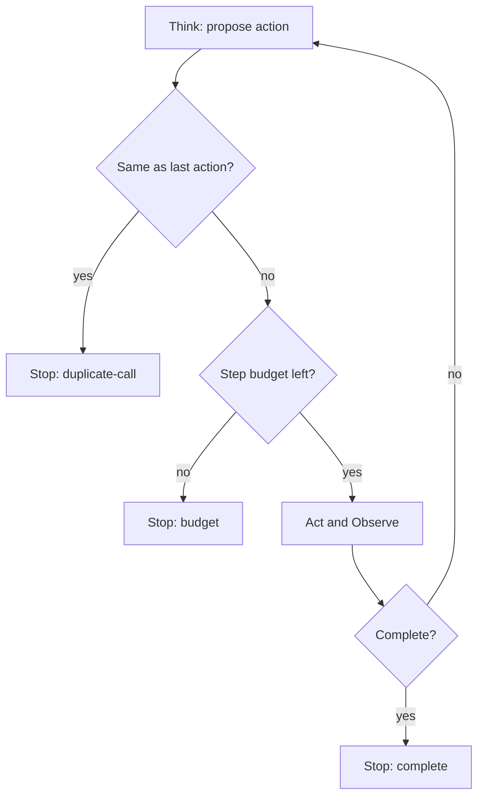

# Build it: the think-act-observe loop

## The loop with a duplicate-call guard

The harness runs **think → act → observe** repeatedly: `think` proposes the next action, the harness
executes it and feeds the observation back. Left unguarded, this loop is a runaway. Two harness-owned
guards keep it safe:

- **Step budget** — a hard `maxSteps` cap that guarantees termination.
- **Duplicate-call guard** — if the model proposes the **same action twice in a row**, it's stuck
  repeating itself; stop instead of looping. (This is the action-level cousin of no-progress
  detection.)

When the loop stops, it returns **why** — `complete`, `budget`, or `duplicate-call`.

## Why the harness owns termination

The model *proposes*; the **harness decides when to stop**. You can't trust the model to stop itself —
the same reasoning that got stuck is the reasoning you'd be asking "are you done?". So termination
lives in harness code: the budget, the duplicate guard, the completion check. And it always reports
the stop reason, because the caller needs it to react — surface a partial result, escalate to a human,
or flag the runaway. A loop that stops silently is nearly as dangerous as one that never stops.
