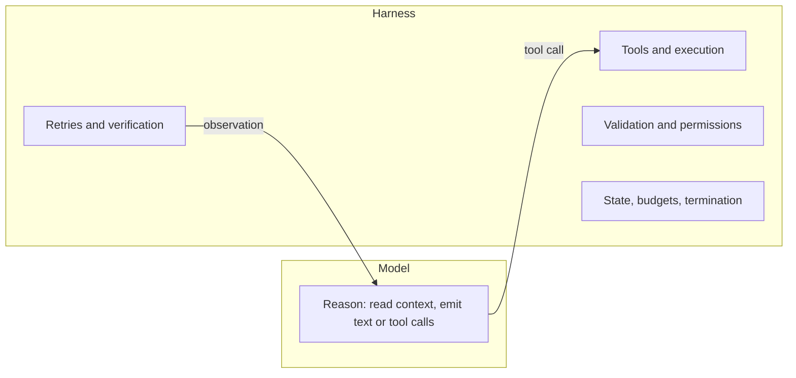

# Harness engineering — the boundary

## The model and the harness

An LLM feature is two parts with a sharp boundary between them.

- The **model** reasons: it reads the context and emits text or tool calls. That's all it does.
- The **harness** is the code around the model. It owns the **tools**, the **state/session**, the
  **permissions**, the **retries**, the **verification**, the persistence, and the user experience.

The single most useful mental model in this field: **reliability lives in the harness, not the
prompt.** When an LLM feature is flaky in production, the fix is almost always harness work
(validation, retries, verification, control flow) — not a cleverer wording of the prompt.

## What the harness owns

Concretely, the harness owns:

- **Tool registry & execution** — what tools exist and running them safely.
- **Argument validation** — checking (and rejecting/repairing) the arguments the model proposes
  before anything executes.
- **Permission gates** — read vs. write separation, confirmation for risky actions.
- **Retries & idempotency** — making operations safe to repeat.
- **Verification** — proving an action actually worked (not trusting that it did).
- **State, sessions, and loop control** — memory, budgets, termination.
- **Error recovery** — turning failures into next actions instead of crashes.

This is why "we just need better prompts" plateaus: prompting can shape *how the model reasons*, but
it cannot supply the tools, the validation, the retries, or the verification. Those are structural —
they have to be built in the harness.
