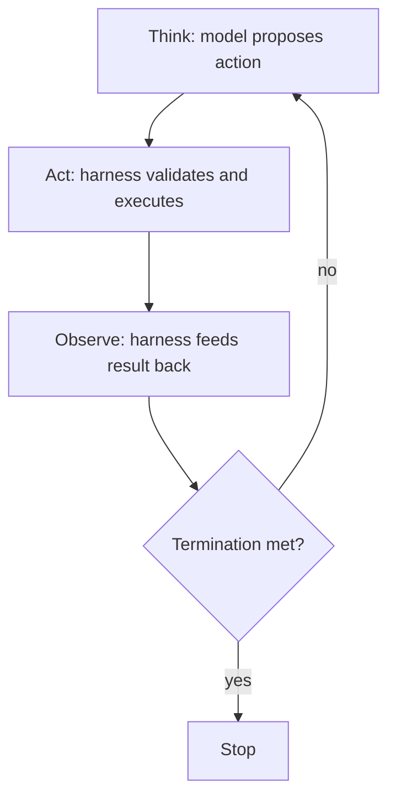

# Harness engineering — the loop

## The agent loop

When a feature does more than a single call, the harness runs an **agent loop**:

1. **Think** — the model proposes the next action (often a tool call) given the current context.
2. **Act** — the harness validates and executes that action.
3. **Observe** — the harness feeds the result back into the context.

…then it repeats, under deadlines and interrupts, until a termination condition is met. The model
supplies the *think*; the harness owns *act* and *observe* — and, crucially, owns **when to stop**.

## Guarding the loop

An unguarded loop is a liability. The harness guards it with:

- **Duplicate-call guards** — detect the model repeating the same tool call and break the cycle.
- **Step / tool / token budgets** — hard caps so a run can't spin forever or run away the bill.
- **No-progress detection** — spot repeated states or oscillation and stop or escalate.

These guards are the difference between an "agent" and an infinite loop with an API key.
