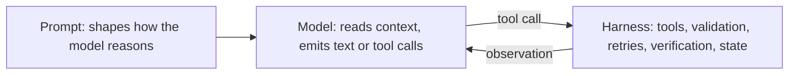

# Harness engineering — the boundary roadmap

## Roadmap: the model and the harness boundary

**What this section covers.** The single most important mental model in the field: an LLM feature
is a *model* that reasons and a *harness* — the code around it — that owns everything else, and
reliability lives on the harness side of that line, not in the prompt.

**The ideas you'll meet:**

- **Model** — the part that reasons: reads the context and emits text or tool calls, and nothing more.
- **Harness** — the code around the model that owns tools, state, permissions, retries, and verification.
- **Reliability lives in the harness** — flaky features are fixed with harness work, not a cleverer prompt.
- **What the harness owns** — tool registry and execution, argument validation, permission gates, retries and idempotency, verification, loop control, and error recovery.
- **Why prompting plateaus** — prompts shape reasoning but can't supply tools, validation, retries, or verification; those are structural.

**Why it matters.** Every later idea — the loop, verification, budgets, recovery — assumes this clean
split, so getting the boundary right is what separates people who *build* agents from people who only
prompt them.
