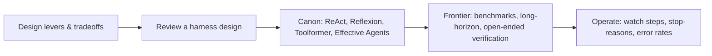

# Harness engineering — design, frontier & operations roadmap

## Roadmap: design, frontier, and operations

**What this section covers.** The senior view: the design levers a systems engineer pulls and how to
review a harness, the canon papers you should be able to name, where the research frontier is, and the
signals you watch once an agent is live in production.

**The ideas you'll meet:**

- **Design levers** — boundary placement, loop control, verification, tool contract & permissions, orchestration shape.
- **Tradeoff table** — name the lever, what it costs, and the regime where it wins.
- **Common → SOTA → antipattern** — a ladder for holding any harness subsystem.
- **The canon** — ReAct (reason-then-act), Reflexion (self-reflect and retry), Toolformer (learned tool use), Anthropic's "Building Effective Agents."
- **Interview signals & red flags** — split model vs. harness cleanly; "just improve the prompt," unverified trust, and unbounded loops sink candidates.
- **The frontier** — agentic-coding benchmarks (SWE-bench-style), reliable long-horizon autonomy, verifying open-ended tasks.
- **Production signals** — steps per task, stop-reason distribution, tool-error rate, verification-failure rate, stuck/no-progress detection.

**Why it matters.** Knowing the canon *and* being able to defend where the harness — not the model —
owns reliability, then operate it on real signals, is what reads as senior in a design review or an
interview.
