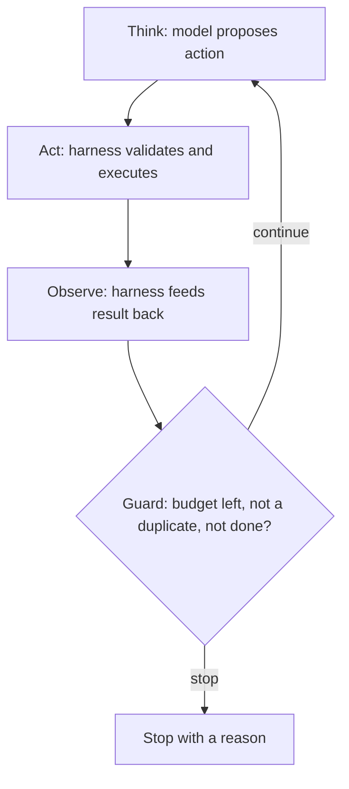

# Harness engineering — the loop roadmap

## Roadmap: the agent loop

**What this section covers.** How the harness turns a single model call into an agent: the
**think → act → observe** loop, and the guards that keep it from becoming an infinite loop with an
API key.

**The ideas you'll meet:**

- **The agent loop** — think (model proposes), act (harness executes), observe (harness feeds the result back), repeat.
- **Termination condition** — the explicit signal that ends the loop; the harness, not the model, owns when to stop.
- **Duplicate-call guard** — detect the model repeating the same action and break the cycle.
- **Budgets** — hard step / tool / token caps so a run can't spin forever or run away the bill.
- **No-progress detection** — spot repeated states or oscillation and stop or escalate.
- **Stop reason** — why the loop ended (`complete`, `budget`, `duplicate-call`), always reported so the caller can react.

**Why it matters.** These guards are the difference between an "agent" and a runaway process, and the
loop is the skeleton every later reliability mechanism hangs off.
