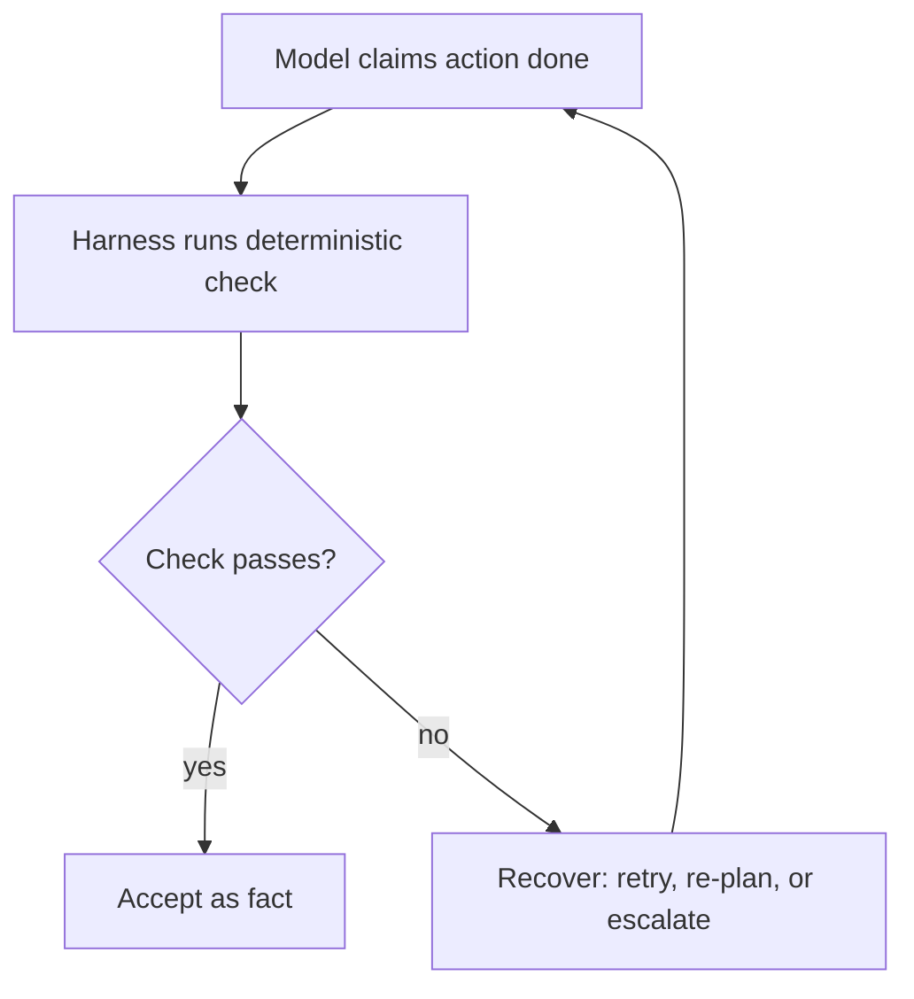

# Harness engineering — verification & control roadmap

## Roadmap: verification and loop control

**What this section covers.** Why a model's claim that it worked is not a fact, and how the harness
converts claims into checked facts with deterministic verification — plus the control levers
(budgets, idempotency, plan-then-execute) that keep autonomy safe.

**The ideas you'll meet:**

- **Don't trust; check** — after a mutating action the harness verifies the real world (tests, `git diff`, run, type-check).
- **Deterministic check** — a real gate on a success signal, not a prompt asking the model "are you sure?".
- **Self-verification is unreliable** — the reasoning that made an error tends to miss it on review.
- **Budgets and termination** — step / tool / token / time caps and explicit "done" signals.
- **Idempotency** — make mutating tools safe to retry so a repeated call has no extra effect.
- **Plan-then-execute** — separate planning from doing so each step can be verified and re-planned.
- **Know when *not* to add agents** — a single bounded loop with good tools usually beats a swarm.

**Why it matters.** Verification and control are what turn a capable model into a *reliable* feature —
without them, a demo that looks done ships changes that are silently broken.
