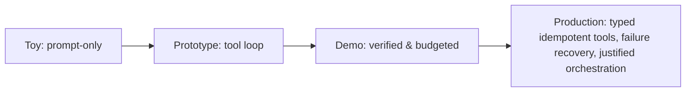

## Reviewing a harness design

**In brief.** Every harness decision trades how much autonomy you grant the model against how much
reliability the surrounding code guarantees. Reviewing one — in a design doc or an interview — means
checking five levers and insisting that reliability is **built in the harness**, never reworded into the
prompt.

**The five levers.**

- **Boundary placement** — how much lives in the harness versus the prompt. Tools, argument validation, retries, and verification are **structural**; pushing a structural failure (invalid tool JSON, a non-idempotent double-write) back onto "a better prompt" is the classic misplacement, and the reason prompting plateaus on exactly those tail failures.
- **Loop control** — the think → act → observe loop plus its guards: duplicate-call detection, step/tool/token/time budgets, no-progress detection, and an explicit termination condition. Without them it's "an infinite loop with an API key."
- **Verification** — a deterministic post-action check (run the tests, read the `git diff`, run the code) versus trusting the model's claim that it worked. Self-review is unreliable: the same reasoning that made the error tends to miss it on review.
- **Tool contract & permissions** — typed contracts, argument validation, read/write separation, confirmation gates for destructive actions, and **idempotent** mutations so a retry is safe.
- **Orchestration shape** — a single bounded loop, plan-then-execute (planning split from doing so each step is independently checkable and re-plannable), or multiple agents — which add coordination-failure surface and are only worth it when the task genuinely needs decomposition or isolation.

**The review checklist.**

- Is the model/harness boundary explicit, or is reliability assumed to come from a better prompt?
- What bounds the loop — any step / tool / token / time budget and an explicit termination condition?
- How is output verified — a real deterministic gate, not "the model reviews its own work"?
- Are tools typed, validated, and idempotent, so a bad argument or a retry can't corrupt state?
- What happens on failure, and is multi-agent orchestration actually justified — or would a single bounded loop with good tools do the job?

**Why it matters.** These five checks place any harness on the toy → prototype → demo → production
ladder in minutes, and they name the red flags that sink a candidate in a design review: "just improve
the prompt" to fix a structural failure, trusting unverified output, and an unbounded loop with no
step / tool / token / cost ceiling.
