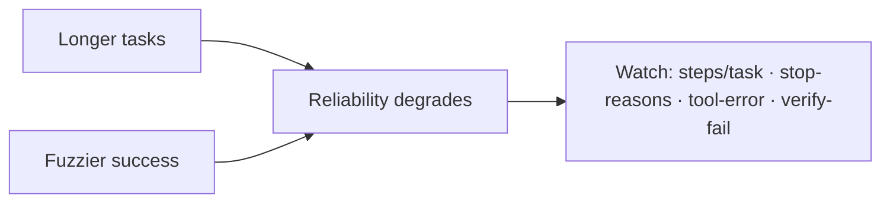

## The frontier & operating a live agent

**In brief.** The research edge and the production dashboard attack the same weakness from two sides:
an agent's reliability degrades as tasks get *longer* and success gets *fuzzier*. Knowing where the
frontier is, and which signals to watch once an agent is live, is what separates someone who *knows*
harness engineering from someone who *runs* it.

**Where the frontier is.**

- **Agentic-coding benchmarks (SWE-bench-style)** — resolve a real issue until the project's own test suite goes green. These harnesses win or lose on **verification** — running the tests and reading the `git diff` to gate on a *real* success signal — far more than on raw model capability. A harness that trusts "I fixed it" without executing the suite is not at the frontier, however strong the base model.
- **Reliable long-horizon autonomy** — still an open problem. As the loop lengthens, context accumulates and small errors compound, so the agent drifts or gets stuck. Length is the enemy, and reliability at length comes from *harness structure* — plan-then-execute, self-reflection/retry, and error recovery that turns a failure into a next action — not a longer prompt.
- **Verifying open-ended tasks** — the hardest problem: "fix this test" has a deterministic gate, "improve this design doc" does not. The honest move is trustworthy *soft* verification (proxy checks, rubric-graded review, human-in-the-loop) without pretending a soft check is a hard one. The SWE-bench gate does not transfer.

**Signals to watch in production.**

- **Steps (turns) per task** — cost and latency scale with loop length, so this is the headline gauge; a creeping average means tasks are getting harder or the agent is thrashing.
- **Stop-reason distribution** — every run ends for a reason (completed, budget-exhausted, duplicate-call, no-progress). A healthy fleet is dominated by *completed*; a rising **budget-exhaustion** rate is the leading indicator that budgets are too tight or tasks too hard, while a rising duplicate-call / no-progress share means the agent is getting *stuck*.
- **Tool-error rate** — bad arguments, hallucinated tool names, timeouts. A rising tool-error rate points at a *tool-contract / argument-validation* gap in the harness, not at the model.
- **Verification-failure rate** — how often the deterministic post-action check rejects a claimed success. A high rate means the model is confidently wrong and the gate is earning its keep — a model-side signal, in contrast to tool-error.

**Why it matters.** Alert on budget-exhaustion and stuck / no-progress rate (the runaway-cost leading
indicators), read verification-failure versus tool-error to tell a *model* problem from a *harness*
problem, and never reason about an agent fleet in "requests" when the real currency is **steps and
tokens per task**.
