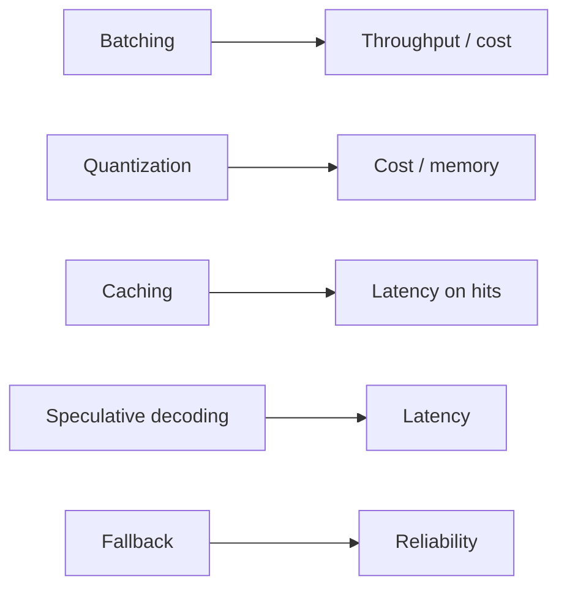

# Inference-stack tradeoffs — levers roadmap

## Roadmap: per-layer levers

**What this section covers.** Each layer of the stack gives you one lever with a dominant axis — the
thing it mainly moves — and a bill it pays elsewhere. Knowing the dominant axis lets you reach for the
right lever when a specific axis is out of budget.

**The ideas you'll meet:**

- **Dominant axis** — the one thing a lever mainly moves; match the lever to the axis that is out of budget.
- **Batching** — amortizes fixed GPU work across many requests (throughput / cost), billed in tail latency.
- **Quantization** — smaller weights fit and run faster (cost / memory, often latency), billed in quality you must measure.
- **Caching** — a hit returns prior work instead of recomputing it (latency / cost), billed in staleness and invalidation.
- **Speculative decoding** — a draft model proposes tokens the target verifies (latency at unchanged quality), billed in extra compute.
- **Fallback** — retry, backup model, or a second provider (reliability), billed in redundancy cost and retry latency.
- **Named systems** — vLLM (paged KV), Orca (continuous batching), Sarathi (chunked prefill), and FrugalGPT (cost/quality cascade): the papers behind these levers.

**Why it matters.** Naming a lever's dominant axis turns tuning into a targeted move rather than
trial-and-error — you pick the lever whose dominant axis matches the axis you need, then check what its
bill does to the other three.
