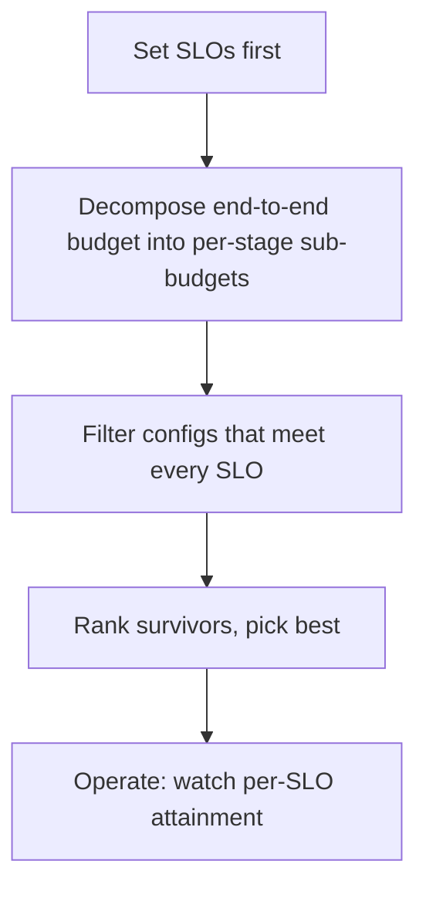

# Inference-stack tradeoffs — SLOs roadmap

## Roadmap: SLOs and operating the stack

**What this section covers.** How SLOs anchor the whole design so tradeoffs are decided on purpose:
set the targets first, decompose the budget into per-stage sub-budgets, filter configs to the feasible
ones, then operate the live stack against every SLO at once.

**The ideas you'll meet:**

- **SLO** — a measurable, fixed target (p99 TTFT, availability, a quality floor) that anchors the design as a constraint, not an aspiration.
- **Budget decomposition** — split an end-to-end SLO into additive per-stage sub-budgets so every layer has a concrete target.
- **Measure-then-optimize** — find the stage that overran its sub-budget, then apply the lever whose dominant axis fixes that stage.
- **Filter-then-rank** — an SLO is a gate: keep only feasible configs, then rank survivors; return null when none is feasible.
- **Per-SLO attainment** — track each SLO against its own target in production, never a single blended latency number.
- **Cost-per-successful-request** — the unit that actually moves; failed and abandoned runs still cost money.
- **Joint optimization** — the frontier: optimize latency, throughput, cost, and quality together, reasoning about how one lever perturbs the others.

**Why it matters.** SLOs flip single-metric thinking on its head — you find the cheapest or best-quality
point that still satisfies every constraint, and then keep it there by watching per-SLO attainment
under real load.
