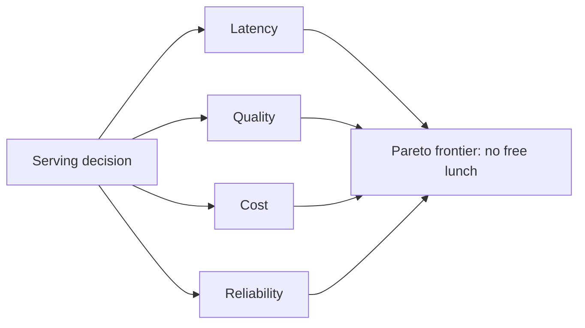

# Inference-stack tradeoffs — tradeoffs roadmap

## Roadmap: the four-way tradeoff

**What this section covers.** Why a serving stack is never tuned along one dimension: every decision
moves you along four coupled axes at once, there is no free lunch, and reviewing a design means
naming what each choice trades away.

**The ideas you'll meet:**

- **The four axes** — latency, quality, cost, and reliability; every serving decision moves all four at once.
- **No free lunch** — almost every lever that improves one axis costs you on another; gains are traded, not created.
- **Pareto frontier** — the set of configs where you can't improve one axis without giving up another; real work is choosing a point on it.
- **Single-metric optimization** — the antipattern of tuning one number in isolation, letting an unmeasured axis quietly blow its limit.
- **Multi-objective optimization** — the right frame: optimize jointly against every constraint before you ship.
- **Reviewing a design** — walking a checklist to rate a stack from toy to production-ready by how honestly it names its tradeoffs.

**Why it matters.** This four-way frame is the foundation the whole topic rests on — levers, SLOs, and
operations all assume you reason about every change's effect on all four axes, not just the one it was
meant to improve.
