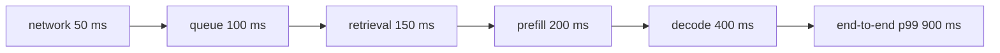

# Inference-stack tradeoffs — SLOs as the anchor

## SLOs anchor the whole design

Given a system with four coupled axes, you need something to anchor the design so the tradeoffs are
decided on purpose, not by accident. That anchor is a set of **SLOs** (service-level objectives) —
measurable targets like *p99 TTFT under 300 ms*, *99.9% availability*, and *a quality floor on your
eval suite*.

SLOs act as **fixed constraints**, not aspirations. The design rule is: first make the config **meet
every SLO**, then optimize whatever is left — usually minimize cost or maximize quality — **within**
that acceptable region. This flips single-metric thinking on its head: you don't chase the lowest
latency or lowest cost, you find the cheapest (or best-quality) point that still satisfies all the
constraints.

Framed this way, the levers from the previous lesson become tools for meeting SLOs. Reliability is a
first-class SLO, so fallback and redundancy earn their cost by keeping you above the availability
target.

## Decomposing the budget

An end-to-end SLO is only actionable once you **decompose** it into per-stage sub-budgets. Take a
900 ms p99 end-to-end latency SLO. It is the **sum** of the stages a request passes through, so split
it into additive sub-budgets that add up to 900 ms — for example:

- network in/out — 50 ms
- queue / wait for batch — 100 ms
- retrieval (if any) — 150 ms
- prefill (TTFT) — 200 ms
- decode — 400 ms

Now every layer has a **concrete target**. When the end-to-end p99 blows the SLO, you measure each
stage's p99 against its sub-budget, find the stage that overran, and apply the lever whose **dominant
axis** fixes that stage — while checking the change respects the other SLOs.

This is the **measure-then-optimize** discipline: don't guess which layer is slow, and don't
optimize a stage that already fits its budget. The end-to-end SLO decomposes into per-stage budgets;
the per-stage budgets tell you exactly where to spend your one free lunch — which, as we've seen, is
never actually free.
