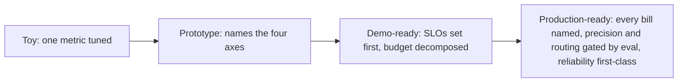

## Reviewing an inference-stack design

**In brief.** Reviewing a serving stack means refusing to accept any claimed win until you know which
axis paid for it. Every lever has a **dominant axis** and a **bill**, and a design is only as senior as
the tradeoffs it names out loud.

**Each lever and the bill it pays.**

- **Continuous batching (Orca)** — buys throughput and lower cost-per-token by amortizing fixed GPU work across many in-flight requests. The bill is **tail latency**: a request can wait for the batch to fill, so p99 rises even as the mean improves. Reach for it when throughput-bound with latency headroom.
- **Paged KV (vLLM)** — buys more concurrency from the same HBM, which is what lets big batches actually run. The bill is allocator complexity, and concurrency stays KV-capped on long contexts.
- **Chunked prefill (Sarathi)** — buys separate TTFT and TPOT targets instead of one blended latency number. The bill is scheduler complexity and some throughput given back. Reach for it when prefill-bound and decode-bound traffic share a GPU.
- **Quantization (INT8 or INT4)** — buys cost, memory, and often latency. The bill is **quality**, by an amount you must measure on the real workload, not assume.
- **Cost-quality cascade (FrugalGPT, Chen et al. 2023)** — the work that framed cost/quality cascades for LLMs: route easy requests to a cheap model and escalate only the hard ones, cutting cost while holding quality. The bill is **routing accuracy** — a misrouted hard request is a degraded answer.
- **Fallback and redundancy** — buys availability and graceful degradation. The bill is redundancy cost and latency on the retry path.

**Why the tail, not the mean.** Latency SLOs are written on a high percentile like p99 because the mean
can look healthy while a meaningful fraction of requests are far slower, and those tail requests are the
real user-visible failures. Levers like batching worsen the tail more than the average, so a mean-based
target would miss exactly the regression the lever caused.

**The review checklist.**

- **Are there SLOs, and were they set first?** No TTFT, TPOT, p99, availability, and quality-floor targets means the design is optimizing a number in a vacuum — stop there.
- **Is the end-to-end budget decomposed?** A design that cannot say which stage owns which slice of the latency budget cannot tell you where to spend a lever.
- **Is every lever's bill named?** A lever with no stated tradeoff is a "free lunch" claim.
- **Was any precision or routing change evaluated?** Quantization or a cascade shipped on the cost number alone is a silent regression waiting to happen. The fix is a quality-floor eval gate on the real workload, not banning the lever.
- **Is reliability first-class?** A real design names its degraded-mode behaviour and availability path under load or failure — never "it just works", and never reliability bolted on at the end.

**The red flags.**

- **Single-metric optimization** — tuning throughput or cost-per-token while tail latency or quality quietly regresses. Optimizing one metric before any SLO exists is premature: the cheapest, highest-utilization config can miss a latency SLO or degrade quality with nothing to catch it. Chasing a second number "as well" just optimizes two numbers in a vacuum; the fix is to set the SLOs first, then minimize cost within that acceptable region.
- **"Free lunch" claims** — any faster-and-cheaper answer with no tradeoff named. "Faster and cheaper across the board" is the classic tell, because the axes are coupled and gains are traded, not created.
- **Premature optimization** — tuning before the SLOs are set.
- **Ignoring the reliability cost** of the levers you add.

**Why it matters.** Name the lever, name what it costs, name the SLO regime where it wins — that is the
design review and the interview answer in miniature. A toy optimizes one metric; a prototype names the
four axes; a demo-ready design anchors on SLOs and decomposes the budget; a **production-ready** design
also names every lever's bill, gates precision and routing changes behind an eval, and treats
reliability as a first-class SLO with a stated degraded-mode path.
