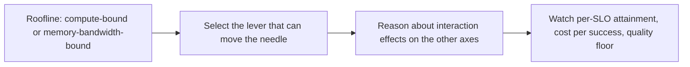

## The frontier and operating the stack

**In brief.** The research edge and the live dashboard attack the same failure from two sides:
reasoning about one axis while an unmeasured one regresses. The frontier refuses to declare a
single-axis win; operations refuse to trust a single blended number.

**Where the frontier is.**

- **Joint optimization over the whole Pareto frontier** — the open problem is optimizing latency, throughput, cost, and quality **together** rather than one at a time. The load-bearing reason single-lever tuning is not enough: the axes are **coupled**, so every lever moves at least two of them. Continuous batching buys throughput but lengthens the tail; quantization buys cost and memory but risks quality; a **FrugalGPT** cascade buys cost but stakes it on routing accuracy. The frontier method reasons about **interaction effects** — how pulling one lever perturbs the others — instead of declaring a win on the single axis the lever was aimed at. The mental model: you are not maximizing one number, you are choosing where on the four-way frontier to sit for a fixed SLO and hardware budget.
- **Predictable SLOs under load** — making the stack's behaviour **stable as concurrency and interference climb**. Best-effort tuning that passes a light-load benchmark routinely blows its p99 once the batch fills, KV pressure rises, and prefill and decode contend for the same GPU. The frontier is **load-aware, SLO-anchored scheduling** — a tail you can predict under real traffic — not a number tuned against an idle baseline and hoped to survive contention.
- **The roofline as the diagnostic** — before reaching for any lever, ask whether the workload is **compute-bound or memory-bandwidth-bound**. That answer tells you which levers can move the needle **at all**: adding compute to a memory-bandwidth-bound decode phase is effort spent on an axis the workload is not limited by. An expert uses the roofline to select the lever, then reasons about what that lever costs on the other three axes.

**Signals to watch when it is live.**

- **Per-SLO attainment, not a single latency number** — track TTFT, TPOT, and end-to-end p99 each against its own target, plus availability and the quality floor. A blended average hides exactly the tail and the phase-specific overrun the levers exist to fix.
- **Cost-per-successful-request** — under a cascade, spend follows routed difficulty rather than request or token count, and failed or abandoned runs still cost money.
- **Headroom and utilization** — sustained utilization near the ceiling means you are one traffic spike from blowing p99; chronically low means you over-provisioned. Because concurrency is **KV-bound**, a creeping average context length silently shrinks the batch and erodes headroom even at a constant request rate — capacity-plan on utilization and context-length trend, not request count alone.
- **The eval + cost + observability triad, read as one dashboard** — observability traces latency and errors, cost tracking rolls up spend per successful request, and a live **eval watches the quality floor** for the **silent regression** a latency or error graph will never show. A precision or routing change can degrade answers while every latency and error dashboard stays green; only the live eval catches that. Reading all three together — not any one alone — is what lets you claim a lever improved the stack rather than quietly regressed an unmeasured axis.

**Why it matters.** Alert on per-SLO attainment and the quality floor, capacity-plan on utilization and
average context length, use the roofline to pick the lever before you tune anything, and never reason
about serving health in a single blended number when the real currency is **all four axes at once**.
